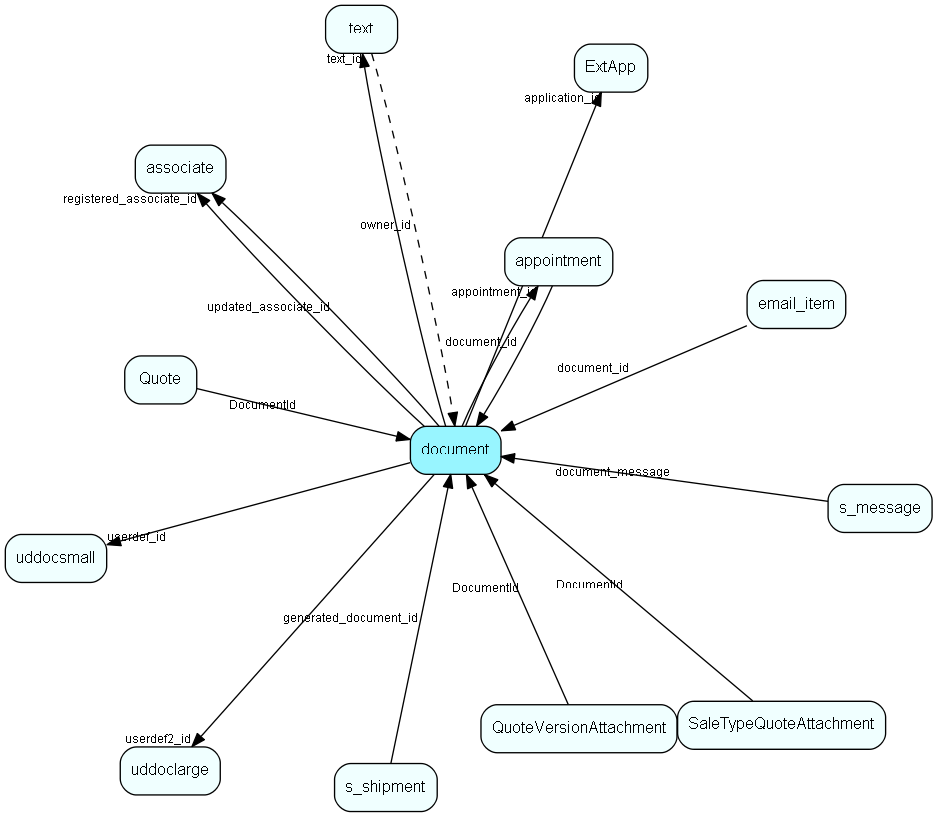

# document Table (10)

Documents, this table is an extension of the Appointment table.  There is always a corresponding appointment record; the relation between appointment and document is navigable in both directions. A document-type appointment record always has a corresponding document record and a record in VisibleFor specifying who may see this.  

## Fields

| Name | Description | Type | Null |
|------|-------------|------|:----:|
|document\_id|Primary key|PK| |
|application\_id|Application this document was made with|FK [ExtApp](extapp.md)| |
|name|File name|String(511)| |
|header|Visible document name|String(219)|&#x25CF;|
|our\_ref|Our reference, searchable field from freetext search|String(99)|&#x25CF;|
|your\_ref|Your reference|String(99)|&#x25CF;|
|searchname|Searchable name (not used?)|String(99)|&#x25CF;|
|attention|Attention/salutation|String(99)|&#x25CF;|
|text\_id|Pointer to optional long description|FK [text](text.md)|&#x25CF;|
|archiveProvider|Document plugin id copied from the DocTmpl.autoevent_id - tells us where the document content is stored|Id|&#x25CF;|
|appointment\_id|points back to owning appointment|FK [appointment](appointment.md)|&#x25CF;|
|registered|Registered when|UtcDateTime| |
|registered\_associate\_id|Registered by whom|FK [associate](associate.md)| |
|updated|Last updated when|UtcDateTime| |
|updated\_associate\_id|Last updated by whom|FK [associate](associate.md)| |
|updatedCount|Number of updates made to this record|UShort| |
|extref|External reference (notes ID, email ID, URL, whatever) for use by document plugin in locating document content|String(511)|&#x25CF;|
|userdef\_id|User-defined fields|FK [uddocsmall](uddocsmall.md)|&#x25CF;|
|userdef2\_id|User-defined fields|FK [uddoclarge](uddoclarge.md)|&#x25CF;|
|snum|The sequence number allocated from refcount on used template when creating the document|Int|&#x25CF;|
|ExtUrl|For DocPlugin-internal use only. Used to optionally cache URL of external documents.|String(1023)|&#x25CF;|
|contentSetCount|Number of times content has been set on this document.|Int| |

[!include[details](./includes/document.md)]

## Indexes

| Fields | Types | Description |
|--------|-------|-------------|
|document\_id |PK |Clustered, Unique |
|header |String(219) |Index |
|our\_ref |String(99) |Index |
|searchname |String(99) |Index |
|archiveProvider |Id |Index |
|extref |String(511) |Index |
|userdef\_id |FK |Index |
|userdef2\_id |FK |Index |

## Relationships

| Table|  Description |
|------|-------------|
|[appointment](appointment.md)  |Tasks, appointments, followups, phone calls; and documents (document_id != 0). An appointment always has a corresponding record in VisibleFor specifying who may see this.  |
|[associate](associate.md)  |Employees, resources and other users - except for External persons |
|[email\_item](email-item.md)  |Email data |
|[ExtApp](extapp.md)  |ExtApp list table. Applications startable from SuperOffice |
|[Quote](quote.md)  |Quote root level, at most one per Sale, always connected to one Sale |
|[QuoteVersionAttachment](quoteversionattachment.md)  |Actual attachments to a quote |
|[s\_message](s-message.md)  |A message used in a shipment. Can be html and/or plain text |
|[s\_shipment](s-shipment.md)  |Contains info about one shipment. The addresses are stored in s_shipment_addr |
|[SaleTypeQuoteAttachment](saletypequoteattachment.md)  |Default attachments to quotes linked to sales of this type |
|[text](text.md)  |Long text fields from all over the system |
|[uddoclarge](uddoclarge.md)  |User-defined fields |
|[uddocsmall](uddocsmall.md)  |User-defined fields |

## Replication Flags

* Area Management controlled table. Contents replicated to satellites and traveller databases.
* Replicate changes UP from satellites and travellers back to central.
* Copy to satellite and travel prototypes.
* Cache table during filtering.

## Security Flags

* Sentry controls access to items in this table using user's Role and data rights matrix on the table's parent.

