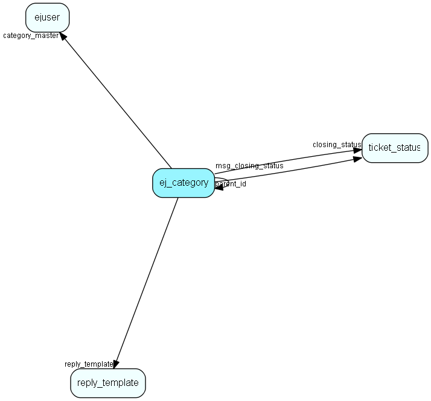

# ej\_category Table (257)

This table contains categories, in which tickets are categorized. The categories are organized in a hierarchial manner.

## Fields

| Name | Description | Type | Null |
|------|-------------|------|:----:|
|id|The primary key (auto-incremented)|PK| |
|parent\_id|The parent category for this category. -1 if this is a toplevel category.|FK [ej_category](ej-category.md)| |
|name|The (short) name of this category. E.g. &amp;apos;support&amp;apos;.|String(64)|&#x25CF;|
|category\_master|The user associated with this category.|FK [ejuser](ejuser.md)|&#x25CF;|
|fullname|The fullname (compiled from parents&amp;apos; names) for this category. E.g. &amp;apos;norway/product A/support&amp;apos;.|String(255)|&#x25CF;|
|flags|A bitmask representing flags for this category.|Enum [TicketCategoryFlags](enums/ticketcategoryflags.md)|&#x25CF;|
|delegate\_method|An integer indicating the delegation method for this category.|Enum [TicketCategoryDelegateMethod](enums/ticketcategorydelegatemethod.md)|&#x25CF;|
|delegate\_counter|A delegate counter, incremented by 1 for every delegation|Int| |
|external\_name|The external name for this category, used for the customer frontend.|String(255)|&#x25CF;|
|assignment\_lag|Number of minutes we shall override the assignment if a customer sends consecutive messages to this category|Int|&#x25CF;|
|reply\_template|Reply template to merge with messages posted in this category|FK [reply_template](reply-template.md)|&#x25CF;|
|notification\_email|Comma separated list of addresses to notify when requests are redelegated to (unassigned) in this category.|String(2047)|&#x25CF;|
|closing\_status|Default status for new tickets, if 0 then there is a fallback to a user-dependent value|FK [ticket_status](ticket-status.md)|&#x25CF;|
|msg\_closing\_status|Default status for new messages, if 0 then there is a fallback to a user-dependent value|FK [ticket_status](ticket-status.md)|&#x25CF;|

[!include[details](./includes/ej-category.md)]

## Indexes

| Fields | Types | Description |
|--------|-------|-------------|
|id |PK |Clustered, Unique |
|parent\_id |FK |Index |
|category\_master |FK |Index |
|reply\_template |FK |Index |

## Relationships

| Table|  Description |
|------|-------------|
|[category\_membership](category-membership.md)  |This table connects users to categories (many-to-many). |
|[chat\_topic](chat-topic.md)  |This table contains chat topics. |
|[cust\_category](cust-category.md)  |This table contains entries for categories exposed through a customer language. |
|[ej\_category](ej-category.md)  |This table contains categories, in which tickets are categorized. The categories are organized in a hierarchial manner. |
|[EjCategoryGroupLink](ejcategorygrouplink.md)  |User group link table for EjCategory, for mass handling ej_category members |
|[ejuser](ejuser.md)  |This table contains entries for the users of the system. |
|[kb\_group](kb-group.md)  |This table contains FAQ groups. A group is a cluster of entries (potentially located anywhere in the FAQ hierarchy). A group is located in a certain category. |
|[mail\_in\_filter](mail-in-filter.md)  |This table contains entries for the mailboxes the eJournal system is fetching mail from (POP3 or IMAP). |
|[ms\_filter](ms-filter.md)  |This table contains email filters. These are the filters allowing you to do advanced parsing of incomming emails. |
|[notify](notify.md)  |This table contains the pop-up messages displayed for users for various events, such as &amp;apos;new ticket&amp;apos;, etc. |
|[reply\_template](reply-template.md)  |Templates for automatic and manual replies to emails/sms organized hierachically |
|[role\_category](role-category.md)  |Category membership associated with a role |
|[s\_link](s-link.md)  |Links in messages to measure success rate of a campaign. |
|[ticket](ticket.md)  |This table contains the tickets (requests) of the system. Its purpose should be evident. |
|[ticket\_status](ticket-status.md)  |This table user defined ticket status values. |

## Replication Flags

* None

## Security Flags

* No access control via user's Role.

