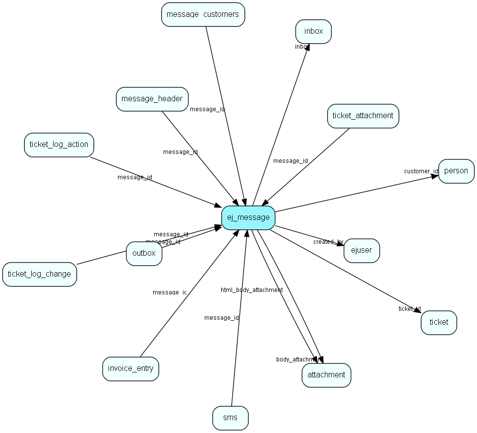

# ej\_message Table (258)

This table contains the messages listed under tickets.

## Fields

| Name | Description | Type | Null |
|------|-------------|------|:----:|
|id|The primary key (auto-incremented)|PK| |
|ticket\_id|The ticket this message is a child of.|FK [ticket](ticket.md)| |
|search\_title|A copy of the title of the ticket, for search optimisation and simpler reporting.|String(255)| |
|created\_at|When the message was posted.|DateTime|&#x25CF;|
|created\_by|The id of the user who posted the message. The value 1 (system user) for externally posted messages.|FK [ejuser](ejuser.md)| |
|type|The type of the message (plaintext/html).|Enum [TicketMessageType](enums/ticketmessagetype.md)|&#x25CF;|
|message\_category|Defines what kind of message this is.|Enum [TicketMessageCategory](enums/ticketmessagecategory.md)| |
|author|A string representing the author of the message. Could be a user&amp;apos;s name, or a persons email address.|String(255)|&#x25CF;|
|slevel|The securitylevel of the message.|Enum [TicketSecurityLevel](enums/ticketsecuritylevel.md)|&#x25CF;|
|message\_id|The Message-Id header value from the email. Used for threading, i.e. connecting messages to existing tickets.|String(850)| |
|time\_spent|The time spent (minutes) for this message.|Int|&#x25CF;|
|time\_charge|The amount of time (minutes) which should be invoiced for this message.|Int|&#x25CF;|
|body|The textbody for the message.|Clob|&#x25CF;|
|html\_body|The html body for the message (if any).|Clob|&#x25CF;|
|email\_header|The email header is saved in this field as raw text|Clob|&#x25CF;|
|debug\_info|The debug info for the message.|Clob|&#x25CF;|
|mail\_sorter|The name of the mail sorter used when the email was imported. Note: We must use name instead of id since the id&amp;apos;s change every time one changes the mail sorter. :-0|String(255)|&#x25CF;|
|customer\_id|If the message was created by email or from the customer center, this field will point to that customer. -1 if the message was created by an user|FK [person](person.md)| |
|body\_attachment|If the body is too long for the database, it&amp;apos;s stored in this attachment instead.|FK [attachment](attachment.md)| |
|html\_body\_attachment|If the htmlbody is too long for the database, it&amp;apos;s stored in this attachment instead.|FK [attachment](attachment.md)| |
|html\_body\_inline\_converted|True if the html_body has converted inline image links.|Bool| |
|inbox|The id of the inbox entry which created this message. Note: inbox entries are regularily deleted.|FK [inbox](inbox.md)|&#x25CF;|
|important|If this message is important or not.|Bool|&#x25CF;|
|language|The language this message is in, based on some kind of analysis|String(10)|&#x25CF;|
|sentiment|Sentiment index, 100 = completely happy; -100 = suicidally unhappy; 0 = no idea|Int|&#x25CF;|
|sentimentConfidence|Confidence of sentiment index, 0 = no idea, 100 = completely sure|Int|&#x25CF;|
|changed\_at|When the message was changed.|DateTime|&#x25CF;|
|changed\_by|The id of the user who changed the message.|FK [ejuser](ejuser.md)|&#x25CF;|
|badge|Badge to explicitly determine how a message was generated|Enum [BadgeType](enums/badgetype.md)| |

[!include[details](./includes/ej-message.md)]

## Indexes

| Fields | Types | Description |
|--------|-------|-------------|
|id |PK |Clustered, Unique |
|ticket\_id |FK |Index |
|created\_by |FK |Index |
|message\_id |String(850) |Index |
|customer\_id |FK |Index |
|body\_attachment |FK |Index |
|html\_body\_attachment |FK |Index |
|search\_title, body, html\_body |String(255), Clob, Clob |Full text |
|created\_at |DateTime |Index |

## Relationships

| Table|  Description |
|------|-------------|
|[attachment](attachment.md)  |This table contains metadata for attachments. The actual attachments are stored directly on disk, with filenames based on the the primary key for this table. |
|[ejuser](ejuser.md)  |This table contains entries for the users of the system. |
|[inbox](inbox.md)  |Info and status for safe email import |
|[invoice\_entry](invoice-entry.md)  |This table contain all invoices, connected to a message |
|[message\_customers](message-customers.md)  |This table contains all cutomers who are involved in a message |
|[message\_header](message-header.md)  |This table contains small pieces of information which is listed over the body for each message. |
|[outbox](outbox.md)  |Outgoing emails with sending status and other info |
|[person](person.md)  |Persons in a company or an organizations. All associates have a corresponding person record |
|[sms](sms.md)  |This table will hold outgoing sms messages when transmitted with WebServices |
|[ticket](ticket.md)  |This table contains the tickets (requests) of the system. Its purpose should be evident. |
|[ticket\_attachment](ticket-attachment.md)  |This table connects an attachment to a message. It references the entry in the attachment table, and the message. |
|[ticket\_log\_action](ticket-log-action.md)  |This table contains actions for the tickets. |
|[ticket\_log\_change](ticket-log-change.md)  |This table contains log entries for the tickets. |

## Replication Flags

* None

## Security Flags

* Sentry controls access to items in this table using user's Role and data rights matrix on the table's parent.

