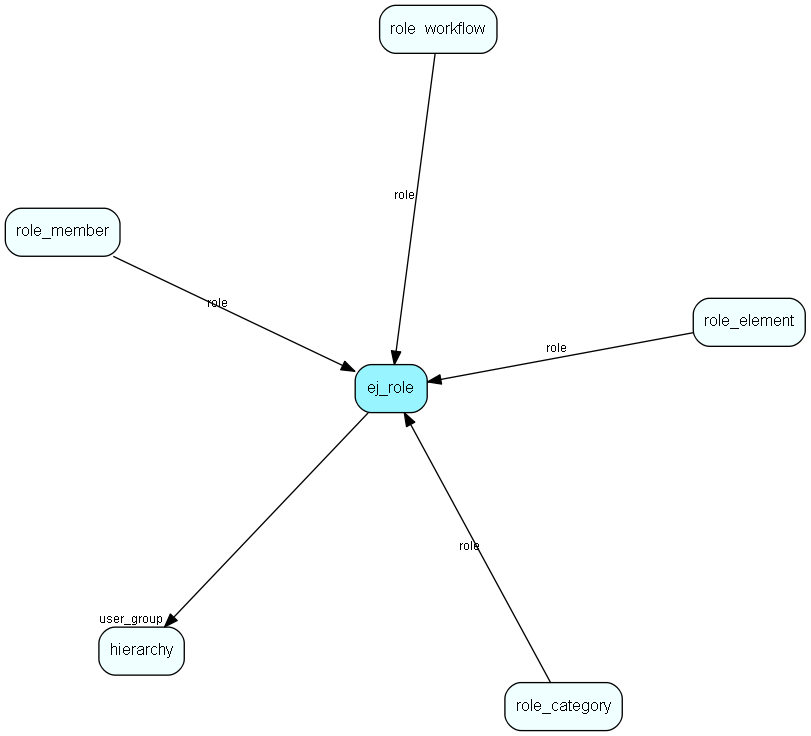

# ej\_role Table (323)

Define access rights, memberships and other properties for role user members

## Fields

| Name | Description | Type | Null |
|------|-------------|------|:----:|
|id|The primary key (auto-incremented)|PK| |
|name|This is the name of the role|String(255)|&#x25CF;|
|use\_user\_group|Override user user group with role|Bool|&#x25CF;|
|user\_group|The group this user is member of |FK [hierarchy](hierarchy.md)| |
|access\_mask|Access mask for users using this role|Int|&#x25CF;|
|access\_values|Access values for users using this role|Int|&#x25CF;|
|use\_categories|Override user categories with role categories|Bool|&#x25CF;|

[!include[details](./includes/ej-role.md)]

## Indexes

| Fields | Types | Description |
|--------|-------|-------------|
|id |PK |Clustered, Unique |
|user\_group |FK |Index |

## Relationships

| Table|  Description |
|------|-------------|
|[hierarchy](hierarchy.md)  |This table contains folders used to group the extra tables in the system. |
|[role\_category](role-category.md)  |Category membership associated with a role |
|[role\_element](role-element.md)  |Profiles associated with a role |
|[role\_member](role-member.md)  |Users linked to a role. Deprecated. |
|[role\_workflow](role-workflow.md)  |Knowledge base workflow access rights associated with a role |

## Replication Flags

* None

## Security Flags

* No access control via user's Role.

