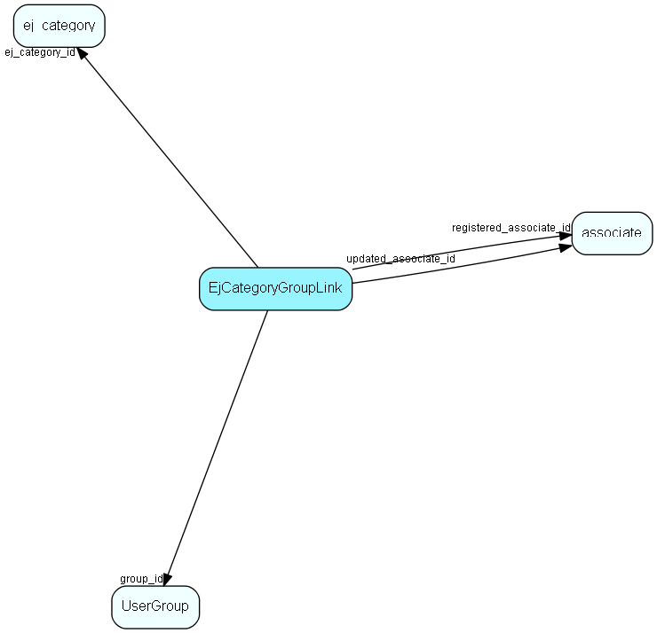

# EjCategoryGroupLink Table (450)

User group link table for EjCategory, for mass handling ej_category members

## Fields

| Name | Description | Type | Null |
|------|-------------|------|:----:|
|ej\_categorygrouplink\_id|Primary key|PK| |
|ej\_category\_id|Link to EjCategory list table|FK [ej_category](ej-category.md)| |
|group\_id|Link to Group table|FK [UserGroup](usergroup.md)| |
|registered|Registered when|UtcDateTime| |
|registered\_associate\_id|Registered by whom|FK [associate](associate.md)| |
|updated|Last updated when|UtcDateTime| |
|updated\_associate\_id|Last updated by whom|FK [associate](associate.md)| |
|updatedCount|Number of updates made to this record|UShort| |

[!include[details](./includes/ejcategorygrouplink.md)]

## Indexes

| Fields | Types | Description |
|--------|-------|-------------|
|ej\_categorygrouplink\_id |PK |Clustered, Unique |
|ej\_category\_id |FK |Index |
|group\_id |FK |Index |

## Relationships

| Table|  Description |
|------|-------------|
|[associate](associate.md)  |Employees, resources and other users - except for External persons |
|[ej\_category](ej-category.md)  |This table contains categories, in which tickets are categorized. The categories are organized in a hierarchial manner. |
|[UserGroup](usergroup.md)  |Secondary user groups |

## Replication Flags

* None

## Security Flags

* No access control via user's Role.

