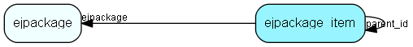

# ejpackage\_item Table (385)

This table stores info on installed packages in the system

## Fields

| Name | Description | Type | Null |
|------|-------------|------|:----:|
|id|Primary key|PK| |
|ejpackage|The id of the package for which this item belongs|FK [ejpackage](ejpackage.md)| |
|idx|The index in the package|Int| |
|domain|The domain for which this item belongs (domains are defined in PackageLib.h)|Int| |
|item\_id|The id of the element for which this item belongs|Int| |
|ref\_name|Used to reference the item in installscript|String(255)|&#x25CF;|
|parent\_id|The parent for this package item link. -1 if this is a toplevel item link.|FK [ejpackage_item](ejpackage-item.md)| |

[!include[details](./includes/ejpackage-item.md)]

## Indexes

| Fields | Types | Description |
|--------|-------|-------------|
|id |PK |Clustered, Unique |
|ejpackage |FK |Index |
|domain |Int |Index |
|item\_id |Int |Index |
|parent\_id |FK |Index |

## Relationships

| Table|  Description |
|------|-------------|
|[ejpackage](ejpackage.md)  |This table stores packages on the system. |
|[ejpackage\_item](ejpackage-item.md)  |This table stores info on installed packages in the system |

## Replication Flags

* None

## Security Flags

* No access control via user's Role.

