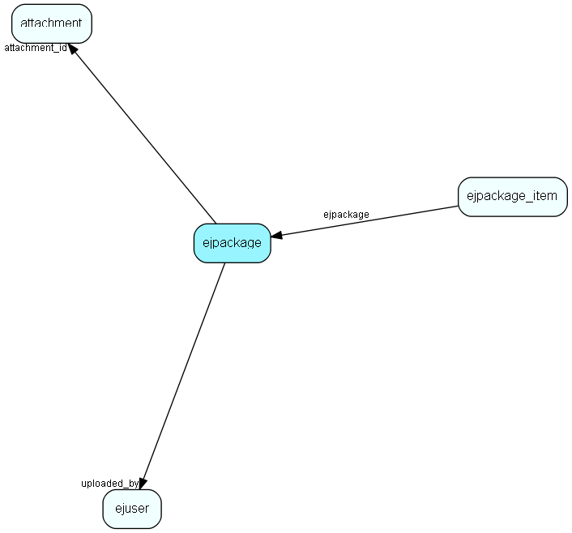

# ejpackage Table (384)

This table stores packages on the system.

## Fields

| Name | Description | Type | Null |
|------|-------------|------|:----:|
|id|Primary key|PK| |
|name|The name of this package|String(255)|&#x25CF;|
|ej\_version|The oldest eJournal version this package can be installed on|String(255)|&#x25CF;|
|package\_version|Version of the created package|String(255)|&#x25CF;|
|description|Description/comment|String(255)|&#x25CF;|
|attachment\_id|The attachment.id for the attachment containing the xml|FK [attachment](attachment.md)| |
|uploaded\_at|Time of upload of this package|DateTime|&#x25CF;|
|uploaded\_by|Uploaded by|FK [ejuser](ejuser.md)| |
|install\_script|Installation script|Clob|&#x25CF;|
|locked|Locked package - components should not be modified by users|Bool| |

[!include[details](./includes/ejpackage.md)]

## Indexes

| Fields | Types | Description |
|--------|-------|-------------|
|id |PK |Clustered, Unique |
|attachment\_id |FK |Index |
|uploaded\_by |FK |Index |

## Relationships

| Table|  Description |
|------|-------------|
|[attachment](attachment.md)  |This table contains metadata for attachments. The actual attachments are stored directly on disk, with filenames based on the the primary key for this table. |
|[ejpackage\_item](ejpackage-item.md)  |This table stores info on installed packages in the system |
|[ejuser](ejuser.md)  |This table contains entries for the users of the system. |

## Replication Flags

* None

## Security Flags

* No access control via user's Role.

