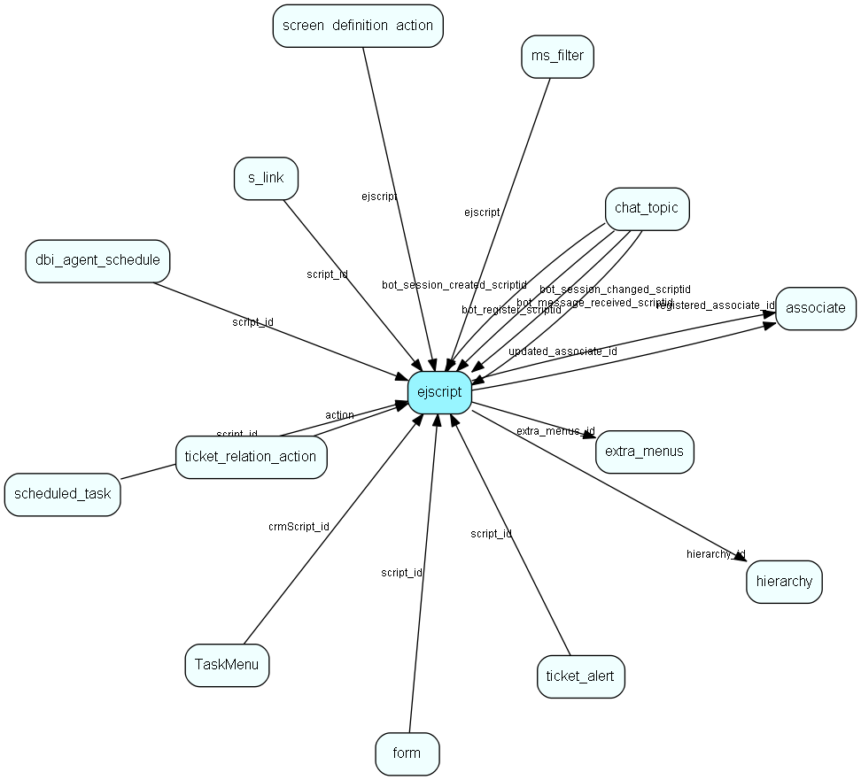

# ejscript Table (377)

ejscript

## Fields

| Name | Description | Type | Null |
|------|-------------|------|:----:|
|id|Primary key|PK| |
|hierarchy\_id|The script is inside this hierarchy folder|FK [hierarchy](hierarchy.md)| |
|description|A description of this script|String(255)|&#x25CF;|
|include\_id|A unique name used for including this script in another|String(255)| |
|access\_key|Access key used to run this script on the customer pages|String(255)|&#x25CF;|
|body|The script|Clob|&#x25CF;|
|html\_output|True if this script will return HTML output|Bool| |
|long\_description|Optional description of what this script is used for.|String(2047)|&#x25CF;|
|extra\_menus\_id|Optional id of related extra menu pointing to this script|FK [extra_menus](extra-menus.md)|&#x25CF;|
|unique\_identifier|Global unique identifier, accross customers/tenants|String(64)| |
|registered|Registered when|UtcDateTime|&#x25CF;|
|registered\_associate\_id|Registered by whom|FK [associate](associate.md)|&#x25CF;|
|updated|Last updated when|UtcDateTime|&#x25CF;|
|updated\_associate\_id|Last updated by whom|FK [associate](associate.md)|&#x25CF;|
|updatedCount|Number of updates made to this record|UShort| |

[!include[details](./includes/ejscript.md)]

## Indexes

| Fields | Types | Description |
|--------|-------|-------------|
|id |PK |Clustered, Unique |
|hierarchy\_id |FK |Index |
|include\_id |String(255) |Index |
|unique\_identifier |String(64) |Unique |

## Relationships

| Table|  Description |
|------|-------------|
|[associate](associate.md)  |Employees, resources and other users - except for External persons |
|[chat\_topic](chat-topic.md)  |This table contains chat topics. |
|[dbi\_agent\_schedule](dbi-agent-schedule.md)  |DBI agent schedule settings |
|[extra\_menus](extra-menus.md)  |This table contains entries for the extra menus in the system. |
|[form](form.md)  |A form which can be published on a webpage and submitted by visitors |
|[hierarchy](hierarchy.md)  |This table contains folders used to group the extra tables in the system. |
|[ms\_filter](ms-filter.md)  |This table contains email filters. These are the filters allowing you to do advanced parsing of incomming emails. |
|[s\_link](s-link.md)  |Links in messages to measure success rate of a campaign. |
|[scheduled\_task](scheduled-task.md)  |A scheduled entry executing a script at certain times |
|[screen\_definition\_action](screen-definition-action.md)  |An action to perform for a certain button in an screen |
|[TaskMenu](taskmenu.md)  |List items to merge into menues |
|[ticket\_alert](ticket-alert.md)  |This table will contain ticket escalation levels. A ticket will be escalated along a &amp;apos;chain&amp;apos; of these levels. |
|[ticket\_relation\_action](ticket-relation-action.md)  |Contains ticket relation actions, used to drive processing logic together with ticket relations |

## Replication Flags

* None

## Security Flags

* No access control via user's Role.

