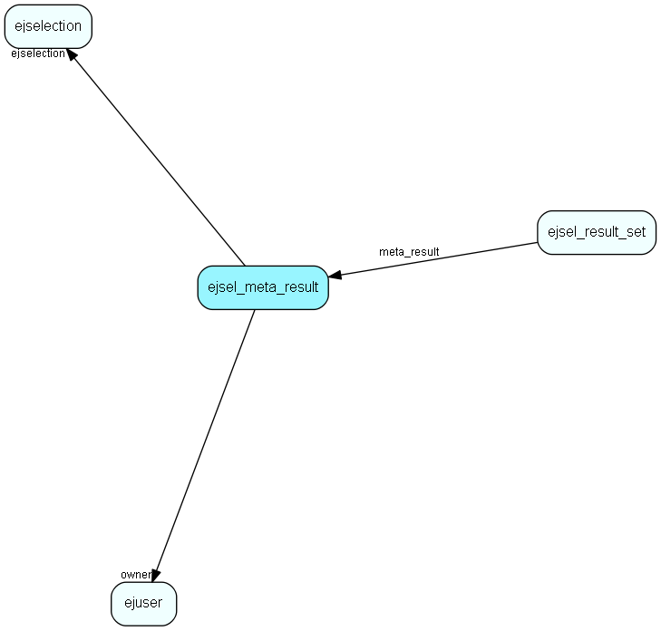

# ejsel\_meta\_result Table (397)

This table stores result meta data

## Fields

| Name | Description | Type | Null |
|------|-------------|------|:----:|
|id|Primary key|PK| |
|ejselection|The id of the selection for which this item is part of a result|FK [ejselection](ejselection.md)| |
|owner|The user who owns this selection result|FK [ejuser](ejuser.md)| |
|created\_at|When the result set was created.|DateTime| |

[!include[details](./includes/ejsel-meta-result.md)]

## Indexes

| Fields | Types | Description |
|--------|-------|-------------|
|id |PK |Clustered, Unique |
|ejselection |FK |Index |
|owner |FK |Index |
|created\_at |DateTime |Index |

## Relationships

| Table|  Description |
|------|-------------|
|[ejsel\_result\_set](ejsel-result-set.md)  |This table stores result set reference data, result sets for selections |
|[ejselection](ejselection.md)  |This table stores selections, dynamic groups. |
|[ejuser](ejuser.md)  |This table contains entries for the users of the system. |

## Replication Flags

* None

## Security Flags

* No access control via user's Role.

