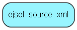

# ejsel\_source\_xml Table (395)

This table stores a selection source as xml

## Fields

| Name | Description | Type | Null |
|------|-------------|------|:----:|
|id|Primary key|PK| |
|xml\_data|XML data of rows and columns|Clob|&#x25CF;|

[!include[details](./includes/ejsel-source-xml.md)]

## Indexes

| Fields | Types | Description |
|--------|-------|-------------|
|id |PK |Clustered, Unique |

## Replication Flags

* None

## Security Flags

* No access control via user's Role.

