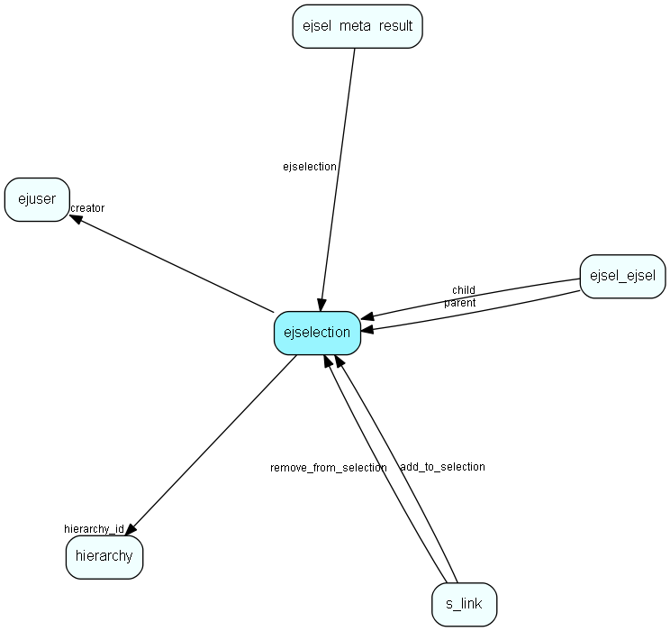

# ejselection Table (391)

This table stores selections, dynamic groups.

## Fields

| Name | Description | Type | Null |
|------|-------------|------|:----:|
|id|Primary key|PK| |
|name|The name of this package|String(255)|&#x25CF;|
|include\_id|A unique name used for refering to selections in scripts, url&amp;apos;s etc.|String(255)| |
|ej\_table|The source table|String(255)|&#x25CF;|
|display\_properties|The display properties of this selection|Clob|&#x25CF;|
|hierarchy\_id|This extra table is inside this hierarchy folder|FK [hierarchy](hierarchy.md)| |
|source\_type|The source type of this selection|Int| |
|source\_id|The id of the source we links to|Int| |
|access\_level|Access level for this selection|Int| |
|left\_menu|Will this selection be listed in the left menu?|Bool|&#x25CF;|
|creator|The user who created this selection|FK [ejuser](ejuser.md)| |
|last\_count|Last result count|Int|&#x25CF;|
|result\_config|XML data|Clob|&#x25CF;|

[!include[details](./includes/ejselection.md)]

## Indexes

| Fields | Types | Description |
|--------|-------|-------------|
|id |PK |Clustered, Unique |
|include\_id |String(255) |Index |
|hierarchy\_id |FK |Index |
|source\_type |Int |Index |
|source\_id |Int |Index |
|creator |FK |Index |

## Relationships

| Table|  Description |
|------|-------------|
|[ejsel\_ejsel](ejsel-ejsel.md)  |This table defines sources for complex selections in a many/many relationship |
|[ejsel\_meta\_result](ejsel-meta-result.md)  |This table stores result meta data |
|[ejuser](ejuser.md)  |This table contains entries for the users of the system. |
|[hierarchy](hierarchy.md)  |This table contains folders used to group the extra tables in the system. |
|[s\_link](s-link.md)  |Links in messages to measure success rate of a campaign. |

## Replication Flags

* None

## Security Flags

* No access control via user's Role.

