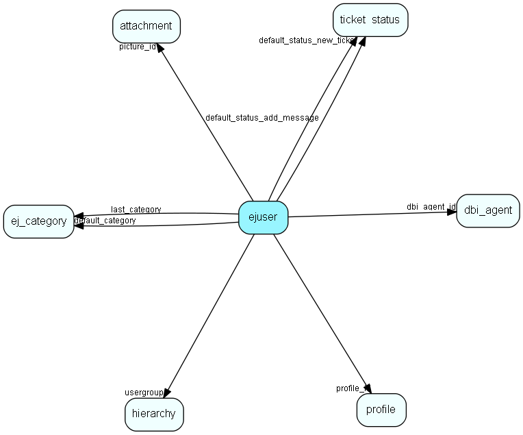

# ejuser Table (299)

This table contains entries for the users of the system.

## Fields

| Name | Description | Type | Null |
|------|-------------|------|:----:|
|id|The primary key (auto-incremented)|PK| |
|loginname|The unique loginname for this user.|String(63)| |
|usergroup|The group this user is member of |FK [hierarchy](hierarchy.md)| |
|username|The unique username for this user.|String(63)| |
|password|The encrypted password for this user.|String(127)|&#x25CF;|
|firstname|The firstname for this user.|String(127)|&#x25CF;|
|middlename|The middlename for this user.|String(127)|&#x25CF;|
|lastname|The lastname for this user.|String(127)|&#x25CF;|
|email|The email address for this user.|String(255)| |
|access\_level|The access level for this user.|Int|&#x25CF;|
|status|The status (enum) for this user.|status|&#x25CF;|
|signature|The users signature.|Clob|&#x25CF;|
|notify\_mask|A bitmask indicating to which extent the user should recieve pop-up warnings for various events.|Int|&#x25CF;|
|email\_mask|A bitmask indicated to which extent the user should recieve email warnings for various events.|Int|&#x25CF;|
|sms\_mask|A bitmask indicated to which extent the user should recieve sms warnings for various events.|Int|&#x25CF;|
|language|A string indicating the user&amp;apos;s language (&amp;apos;no&amp;apos; or &amp;apos;en&amp;apos;).|String(5)|&#x25CF;|
|dictionary|A string indicating the user&amp;apos;s prefered dictionary language (&amp;apos;no&amp;apos; or &amp;apos;en&amp;apos;).|String(5)|&#x25CF;|
|default\_category|The default category for this user when posting tickets and use_last_category is false. |FK [ej_category](ej-category.md)| |
|textareasize|Size of textarea for each user, example &amp;apos;80x40&amp;apos;|String(31)|&#x25CF;|
|flags|A bitmask indicating flags for this entry.|Int|&#x25CF;|
|last\_category|The last chosen category for this user when posting tickets.|FK [ej_category](ej-category.md)|&#x25CF;|
|profile\_id|Reference to the profile connected to this ejuser|FK [profile](profile.md)|&#x25CF;|
|hidden\_bag\_bitset|Each character represent a bit to set a HtmlBagHideable to default open or closed (1=open 0=closed)|String(255)|&#x25CF;|
|notify\_external\_lock|A datetime lock to make sure notifications are only displayed by one notifcation system (ejournal or external programs)|DateTime|&#x25CF;|
|notify\_external\_source|A name (id) of the external notifications system (ejournal or external programs)|String(255)|&#x25CF;|
|login\_attempts|The number of times the user has attempted to login with the wrong password|Int|&#x25CF;|
|last\_login\_attempt|The last time the user tried to log in without success|DateTime|&#x25CF;|
|idle\_time|Number of seconds the user has been idle. Updated by TrayIcon or simular external programs.|Int| |
|default\_user|The default user to set on new tickets in this category (1=automatically, 2=unasigned, 3=the owner|Int|&#x25CF;|
|sms|The SMS number for this user|String(64)|&#x25CF;|
|new\_gui|Whether to use the new gui or not|Bool| |
|dbi\_agent\_id|Integration agent (eJournal)|FK [dbi_agent](dbi-agent.md)| |
|dbi\_key|The primary key for the integrated entry in the external datasource.|String(255)| |
|dbi\_last\_syncronized|Last external syncronization.|DateTime| |
|dbi\_last\_modified|When the entry was last modified.|DateTime| |
|minute\_offset|Offset in hours between server and ejuser timezone.|Int| |
|date\_format|The preferred format of dates and datetimes (enum) for this user.|date_format| |
|simultaneous\_login|A boolean telling if the user is counted as one of the simultaneous ones, or one who alway may log in|Bool| |
|picture\_id|The attachment.id this reference is connected to.|FK [attachment](attachment.md)|&#x25CF;|
|not\_present|Comment to add for user when status is not present.|String(255)|&#x25CF;|
|default\_status\_new\_ticket|Default status on new requests.|FK [ticket_status](ticket-status.md)|&#x25CF;|
|default\_status\_add\_message|Default status on add message.|FK [ticket_status](ticket-status.md)|&#x25CF;|
|num\_expanded\_messages|The number of expanded messages in show-ticket view.|Int| |
|date\_format\_string|Chosen date format as a string for this user|String(64)|&#x25CF;|
|time\_format\_string|Chosen time format as a string for this user|String(64)|&#x25CF;|
|date\_format\_long\_string|Chosen date format for lists as a string for this user|String(64)|&#x25CF;|
|chat\_status|Various chat statuses for an agent|Enum [ChatStatus](enums/chatstatus.md)|&#x25CF;|

[!include[details](./includes/ejuser.md)]

## Indexes

| Fields | Types | Description |
|--------|-------|-------------|
|id |PK |Clustered, Unique |
|loginname |String(63) |Index |
|usergroup |FK |Index |
|username |String(63) |Index |
|email |String(255) |Index |
|default\_category |FK |Index |
|last\_category |FK |Index |
|profile\_id |FK |Index |
|dbi\_agent\_id |FK |Index |
|dbi\_key |String(255) |Index |
|dbi\_last\_syncronized |DateTime |Index |
|dbi\_last\_modified |DateTime |Index |
|picture\_id |FK |Index |
|default\_status\_new\_ticket |FK |Index |
|default\_status\_add\_message |FK |Index |

## Relationships

| Table|  Description |
|------|-------------|
|[associate](associate.md)  |Employees, resources and other users - except for External persons |
|[attachment](attachment.md)  |This table contains metadata for attachments. The actual attachments are stored directly on disk, with filenames based on the the primary key for this table. |
|[category\_membership](category-membership.md)  |This table connects users to categories (many-to-many). |
|[chat\_message](chat-message.md)  |This table contains messages in a chat session. |
|[chat\_session](chat-session.md)  |This table contains chat sessions. |
|[chat\_topic\_user](chat-topic-user.md)  |This table connected the chat topics with the users (i.e. the membership). |
|[dbi\_agent](dbi-agent.md)  |DBI agent settings |
|[dictionary](dictionary.md)  |User added dictionary words |
|[doc\_document](doc-document.md)  |This table contains documents. |
|[doc\_folder](doc-folder.md)  |A document folder. |
|[ej\_category](ej-category.md)  |This table contains categories, in which tickets are categorized. The categories are organized in a hierarchial manner. |
|[ej\_message](ej-message.md)  |This table contains the messages listed under tickets. |
|[ejpackage](ejpackage.md)  |This table stores packages on the system. |
|[ejsel\_meta\_result](ejsel-meta-result.md)  |This table stores result meta data |
|[ejselection](ejselection.md)  |This table stores selections, dynamic groups. |
|[element\_profile](element-profile.md)  |The new (4.0) profile table. Contains profile for a single Html-element. Connected through element_profile_link |
|[external\_document](external-document.md)  |This table stores documents which can be viewed externaly, through the customer module |
|[hierarchy](hierarchy.md)  |This table contains folders used to group the extra tables in the system. |
|[hotlist](hotlist.md)  |The table is used by the hotlist to store the relationship between tickets and users |
|[kb\_category](kb-category.md)  |Knowledge base folder hierarchy |
|[kb\_category\_log](kb-category-log.md)  |Who and when, if somebody edits a knowledge base folder |
|[kb\_entry](kb-entry.md)  |This table contains FAQ entries. |
|[kb\_entry\_log](kb-entry-log.md)  |Who and when, if somebody edits a knowledge base entry |
|[kb\_workflow\_access](kb-workflow-access.md)  |Control of who can do what in a knowledge base workflow step |
|[login](login.md)  |This table contains entries for the user sessions.  |
|[ms\_filter](ms-filter.md)  |This table contains email filters. These are the filters allowing you to do advanced parsing of incomming emails. |
|[notify](notify.md)  |This table contains the pop-up messages displayed for users for various events, such as &amp;apos;new ticket&amp;apos;, etc. |
|[profile](profile.md)  |Deprecated. This table contains entries for the user profiles. |
|[reply\_template](reply-template.md)  |Templates for automatic and manual replies to emails/sms organized hierachically |
|[role\_member](role-member.md)  |Users linked to a role. Deprecated. |
|[s\_link](s-link.md)  |Links in messages to measure success rate of a campaign. |
|[ticket](ticket.md)  |This table contains the tickets (requests) of the system. Its purpose should be evident. |
|[ticket\_alert](ticket-alert.md)  |This table will contain ticket escalation levels. A ticket will be escalated along a &amp;apos;chain&amp;apos; of these levels. |
|[ticket\_log\_action](ticket-log-action.md)  |This table contains actions for the tickets. |
|[ticket\_status](ticket-status.md)  |This table user defined ticket status values. |
|[user\_attribute](user-attribute.md)  |This table is used for storing various attributes for users. |

## Replication Flags

* None

## Security Flags

* No access control via user's Role.

