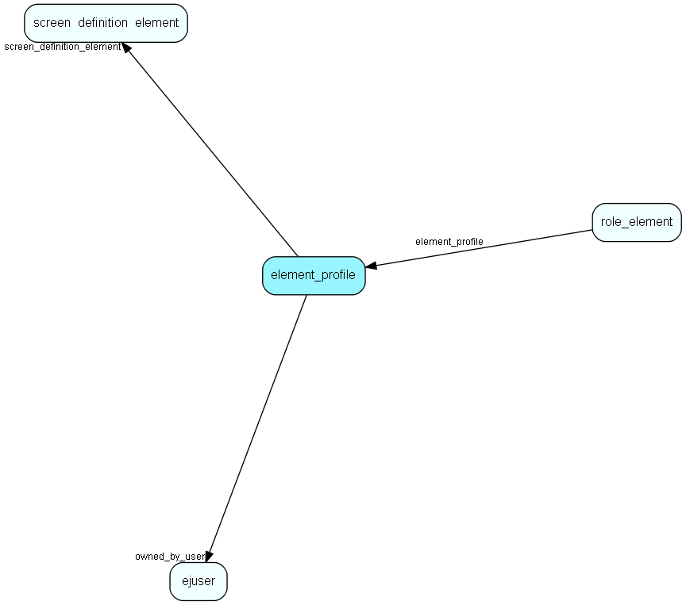

# element\_profile Table (328)

The new (4.0) profile table. Contains profile for a single Html-element. Connected through element_profile_link

## Fields

| Name | Description | Type | Null |
|------|-------------|------|:----:|
|id|The primary key (auto-incremented)|PK| |
|name|This is the name used by common profiles|String(255)|&#x25CF;|
|static\_element|An enum for which HtmlElement this is. All profileable elements in static screens has a unique enum matching this one.|static_element|&#x25CF;|
|screen\_definition\_element|The id of the screen_definition_element.|FK [screen_definition_element](screen-definition-element.md)| |
|profile\_type|Enum indicating whether this is the default profile (only one), user profile or a common profile. Defined in Profile.h|profile_type|&#x25CF;|
|element\_type|What kind of element is this? Static, blogic or extra table?|element_type|&#x25CF;|
|owned\_by\_user|The id of the user.|FK [ejuser](ejuser.md)| |
|config|The actual profile data. Each HtmlElement may choose format. Normally XML.|Clob|&#x25CF;|
|filter\_field|Name of field, if any, that is used to filter which profiles should be shown|String(254)|&#x25CF;|
|filter\_value|If filter_field is set, then this field is the value that is used to filter which profiles should be shown|String(254)|&#x25CF;|

[!include[details](./includes/element-profile.md)]

## Indexes

| Fields | Types | Description |
|--------|-------|-------------|
|id |PK |Clustered, Unique |
|screen\_definition\_element |FK |Index |
|owned\_by\_user |FK |Index |

## Relationships

| Table|  Description |
|------|-------------|
|[ejuser](ejuser.md)  |This table contains entries for the users of the system. |
|[role\_element](role-element.md)  |Profiles associated with a role |
|[screen\_definition\_element](screen-definition-element.md)  |An element in a configurable screen |

## Replication Flags

* None

## Security Flags

* No access control via user's Role.

