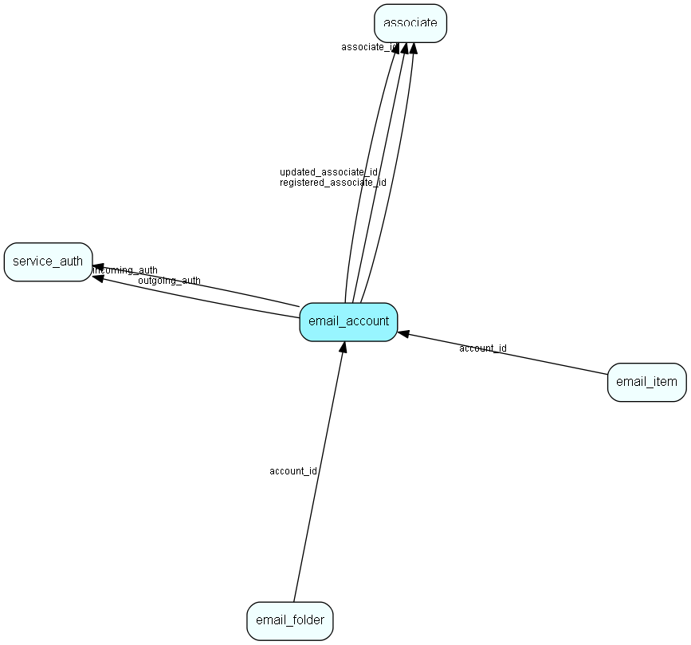

# email\_account Table (486)

Email account information

## Fields

| Name | Description | Type | Null |
|------|-------------|------|:----:|
|email\_account\_id|Primary key|PK| |
|email\_address|The From-address|String(255)|&#x25CF;|
|associate\_id|Associate who owns this email account|FK [associate](associate.md)|&#x25CF;|
|incoming\_auth|Incoming server (imap) authentication |FK [service_auth](service-auth.md)|&#x25CF;|
|outgoing\_auth|Outgoing server (smtp) authentication |FK [service_auth](service-auth.md)|&#x25CF;|
|registered|Registered when|UtcDateTime| |
|registered\_associate\_id|Registered by whom|FK [associate](associate.md)| |
|updated|Last updated when|UtcDateTime| |
|updated\_associate\_id|Last updated by whom|FK [associate](associate.md)| |
|updatedCount|Number of updates made to this record|UShort| |
|default|True if this account is the default account for the associate who owns it|Bool|&#x25CF;|
|account\_status|The status of this email account|Enum [EmailAccountStatus](enums/emailaccountstatus.md)|&#x25CF;|
|encryptedCheck|Encrypted hash checksum|String(254)| |
|error\_count|How many failures since reset|Int|&#x25CF;|
|error\_reason|Reason for last failure if available|String(254)| |
|simple\_mode|Simple mode used for sending and retrieving invitations, accept/decline etc. without the full Inbox GUI experience, if for instance you prefer Outlook or other for that.|Bool|&#x25CF;|
|last\_fetch|When we last fetched email.|UtcDateTime|&#x25CF;|

[!include[details](./includes/email-account.md)]

## Indexes

| Fields | Types | Description |
|--------|-------|-------------|
|email\_account\_id |PK |Clustered, Unique |
|email\_address |String(255) |Unique |
|associate\_id |FK |Index |

## Relationships

| Table|  Description |
|------|-------------|
|[associate](associate.md)  |Employees, resources and other users - except for External persons |
|[email\_folder](email-folder.md)  |Corresponds to an email folder on a mail server |
|[email\_item](email-item.md)  |Email data |
|[service\_auth](service-auth.md)  |Authentication for a service (imap, smtp...) |

## Replication Flags

* None

## Security Flags

* No access control via user's Role.

