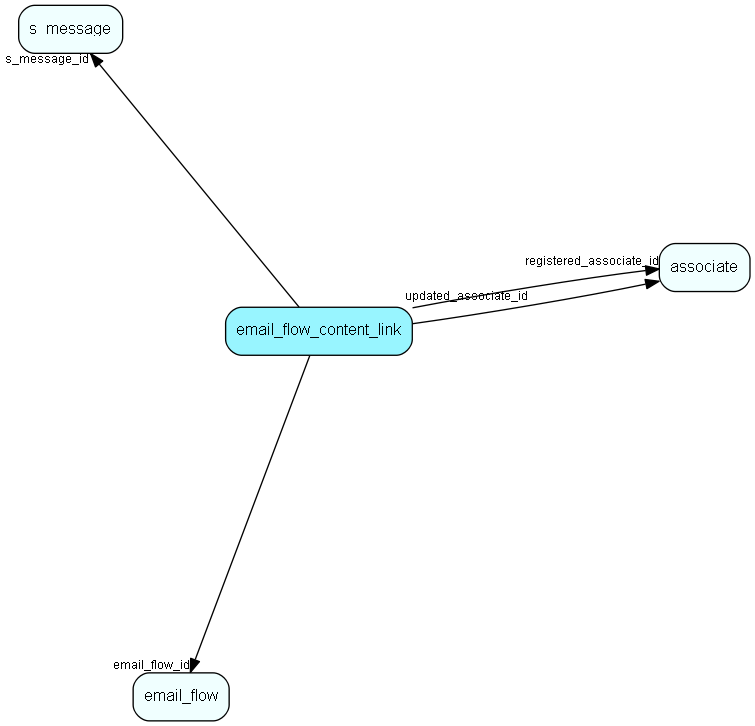

# email\_flow\_content\_link Table (518)

Links content to an email workflow

## Fields

| Name | Description | Type | Null |
|------|-------------|------|:----:|
|email\_flow\_content\_link\_id|Primary key|PK| |
|s\_message\_id|A shipment message available in the flow|FK [s_message](s-message.md)|&#x25CF;|
|email\_flow\_id|The email flow the content is connected to|FK [email_flow](email-flow.md)|&#x25CF;|
|registered|Registered when|UtcDateTime| |
|registered\_associate\_id|Registered by whom|FK [associate](associate.md)| |
|updated|Last updated when|UtcDateTime| |
|updated\_associate\_id|Last updated by whom|FK [associate](associate.md)| |
|updatedCount|Number of updates made to this record|UShort| |
|form\_id|Web form used in the flow|FK [form](form.md)|&#x25CF;|
|s\_link\_id|Shipment link used in the flow|FK [s_link](s-link.md)|&#x25CF;|

[!include[details](./includes/email-flow-content-link.md)]

## Indexes

| Fields | Types | Description |
|--------|-------|-------------|
|email\_flow\_content\_link\_id |PK |Clustered, Unique |

## Relationships

| Table|  Description |
|------|-------------|
|[associate](associate.md)  |Employees, resources and other users - except for External persons |
|[email\_flow](email-flow.md)  |A set of properties related to the email workflow. |
|[form](form.md)  |A form which can be published on a webpage and submitted by visitors |
|[s\_link](s-link.md)  |Links in messages to measure success rate of a campaign. |
|[s\_message](s-message.md)  |A message used in a shipment. Can be html and/or plain text |

## Replication Flags

* None

## Security Flags

* Sentry controls access to items in this table using user's Role and data rights matrix on the table's parent.

