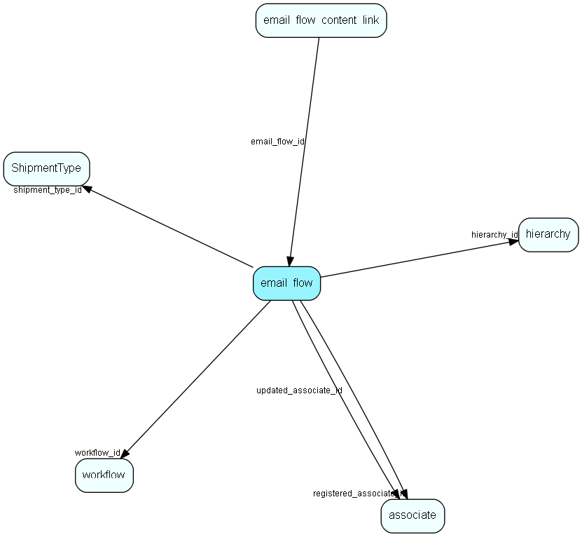

# email\_flow Table (509)

A set of properties related to the email workflow.

## Fields

| Name | Description | Type | Null |
|------|-------------|------|:----:|
|email\_flow\_id|Primary key|PK| |
|workflow\_id|The flow this instance belongs to|FK [workflow](workflow.md)|&#x25CF;|
|shipment\_type\_id|Mailing type (subscription type)|FK [ShipmentType](shipmenttype.md)|&#x25CF;|
|override\_consent\_subscription|Override consent and subscription|Bool|&#x25CF;|
|registered|Registered when|UtcDateTime| |
|registered\_associate\_id|Registered by whom|FK [associate](associate.md)| |
|updated|Last updated when|UtcDateTime| |
|updated\_associate\_id|Last updated by whom|FK [associate](associate.md)| |
|updatedCount|Number of updates made to this record|UShort| |
|hierarchy\_id|This email flow is inside that hierarchy folder|FK [hierarchy](hierarchy.md)| |

[!include[details](./includes/email-flow.md)]

## Indexes

| Fields | Types | Description |
|--------|-------|-------------|
|email\_flow\_id |PK |Clustered, Unique |
|hierarchy\_id |FK |Index |

## Relationships

| Table|  Description |
|------|-------------|
|[associate](associate.md)  |Employees, resources and other users - except for External persons |
|[hierarchy](hierarchy.md)  |This table contains folders used to group the extra tables in the system. |
|[ShipmentType](shipmenttype.md)  |Shipment type list table. Classification of a mailing, allowing recipients to subscribe to lists |
|[workflow](workflow.md)  |SuperOffice specific info about a workflow |

## Replication Flags

* None

## Security Flags

* Sentry controls access to items in this table using user's Role and data rights matrix on the table's parent.

