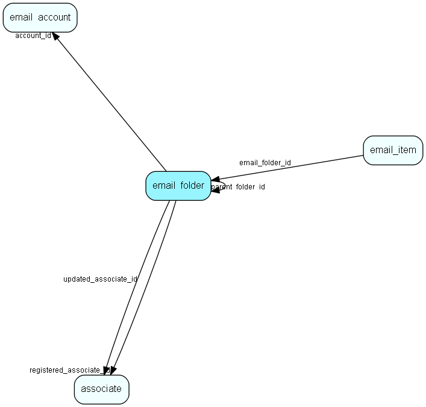

# email\_folder Table (487)

Corresponds to an email folder on a mail server

## Fields

| Name | Description | Type | Null |
|------|-------------|------|:----:|
|email\_folder\_id|Primary key|PK| |
|account\_id|Account id|FK [email_account](email-account.md)|&#x25CF;|
|parent\_folder\_id|Parent folder|FK [email_folder](email-folder.md)|&#x25CF;|
|name|Folder name|String(255)|&#x25CF;|
|attributes|Folder attributes like Subscribed, HasChildren, Junk, Sent...|Int|&#x25CF;|
|registered|Registered when|UtcDateTime| |
|registered\_associate\_id|Registered by whom|FK [associate](associate.md)| |
|updated|Last updated when|UtcDateTime| |
|updated\_associate\_id|Last updated by whom|FK [associate](associate.md)| |
|updatedCount|Number of updates made to this record|UShort| |
|folder\_separator|Character separating subfolders|String(255)|&#x25CF;|

[!include[details](./includes/email-folder.md)]

## Indexes

| Fields | Types | Description |
|--------|-------|-------------|
|email\_folder\_id |PK |Clustered, Unique |
|account\_id |FK |Index |

## Relationships

| Table|  Description |
|------|-------------|
|[associate](associate.md)  |Employees, resources and other users - except for External persons |
|[email\_account](email-account.md)  |Email account information |
|[email\_folder](email-folder.md)  |Corresponds to an email folder on a mail server |
|[email\_item](email-item.md)  |Email data |

## Replication Flags

* None

## Security Flags

* No access control via user's Role.

