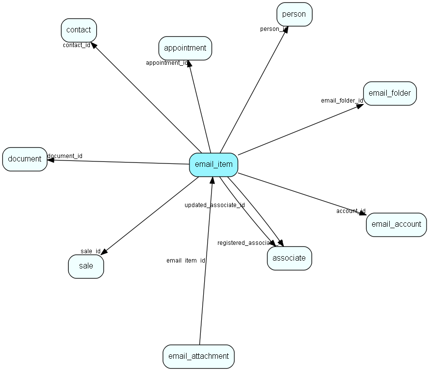

# email\_item Table (489)

Email data

## Fields

| Name | Description | Type | Null |
|------|-------------|------|:----:|
|email\_item\_id|Primary key|PK| |
|account\_id|Account id|FK [email_account](email-account.md)|&#x25CF;|
|server\_id|Email server id of this email item|Int| |
|flags|Email flags - answered, deleted, seen, flagged, draft, recent...|Enum [EMailFlags](enums/emailflags.md)|&#x25CF;|
|email\_folder\_id|Folder this email is in on the imap server|FK [email_folder](email-folder.md)|&#x25CF;|
|mime|Mime text|Clob|&#x25CF;|
|messageId|Email MessageId|String(512)|&#x25CF;|
|sent\_at|Sent datetime from mime|DateTime|&#x25CF;|
|received\_at|Received by email server|DateTime|&#x25CF;|
|subject|Email subject|String(255)|&#x25CF;|
|plain\_body|Plain body text|Clob|&#x25CF;|
|html\_body|Html body text|Clob|&#x25CF;|
|priority|Email priority|Enum [EMailPriority](enums/emailpriority.md)|&#x25CF;|
|registered|Registered when|UtcDateTime| |
|registered\_associate\_id|Registered by whom|FK [associate](associate.md)| |
|updated|Last updated when|UtcDateTime| |
|updated\_associate\_id|Last updated by whom|FK [associate](associate.md)| |
|updatedCount|Number of updates made to this record|UShort| |
|has\_attachment|Has attachment(s)|Bool|&#x25CF;|
|from|From address|String(4000)|&#x25CF;|
|to|To|String(4000)|&#x25CF;|
|size|The size of the email|Int| |
|person\_id|From person|FK [person](person.md)|&#x25CF;|
|contact\_id|From company|FK [contact](contact.md)|&#x25CF;|
|document\_id|Archived document|FK [document](document.md)|&#x25CF;|
|appointment\_id|Archived on appointment|FK [appointment](appointment.md)|&#x25CF;|
|sale\_id|Archived on sale|FK [sale](sale.md)|&#x25CF;|
|replied\_at|When this email was replied to|DateTime|&#x25CF;|
|in\_reply\_to|In reply to, a message-id, used for threading|String(512)|&#x25CF;|
|cc|Cc|String(4000)|&#x25CF;|
|cal\_data|Calendar data|Clob|&#x25CF;|

[!include[details](./includes/email-item.md)]

## Indexes

| Fields | Types | Description |
|--------|-------|-------------|
|email\_item\_id |PK |Clustered, Unique |
|server\_id |Int |Index |
|account\_id |FK |Index |
|account\_id, server\_id |FK, Int |Index |
|messageId |String(512) |Index |
|email\_folder\_id |FK |Index |

## Relationships

| Table|  Description |
|------|-------------|
|[appointment](appointment.md)  |Tasks, appointments, followups, phone calls; and documents (document_id != 0). An appointment always has a corresponding record in VisibleFor specifying who may see this.  |
|[associate](associate.md)  |Employees, resources and other users - except for External persons |
|[contact](contact.md)  |Companies and Organizations.   This table features a special record containing information about the contact that owns the database.   |
|[document](document.md)  |Documents, this table is an extension of the Appointment table.  There is always a corresponding appointment record; the relation between appointment and document is navigable in both directions. A document-type appointment record always has a corresponding document record and a record in VisibleFor specifying who may see this.   |
|[email\_account](email-account.md)  |Email account information |
|[email\_attachment](email-attachment.md)  |Attachment info related to an email_item |
|[email\_folder](email-folder.md)  |Corresponds to an email folder on a mail server |
|[person](person.md)  |Persons in a company or an organizations. All associates have a corresponding person record |
|[sale](sale.md)  |Sales  For every Sale record edited through the SuperOffice GUI, a copy of the current version of the record will be saved in the SaleHist table. This also applies to editing done through the SaleModel COM interface, but not to editing done through the OLE DB Provider or other channels.   |

## Replication Flags

* None

## Security Flags

* No access control via user's Role.

