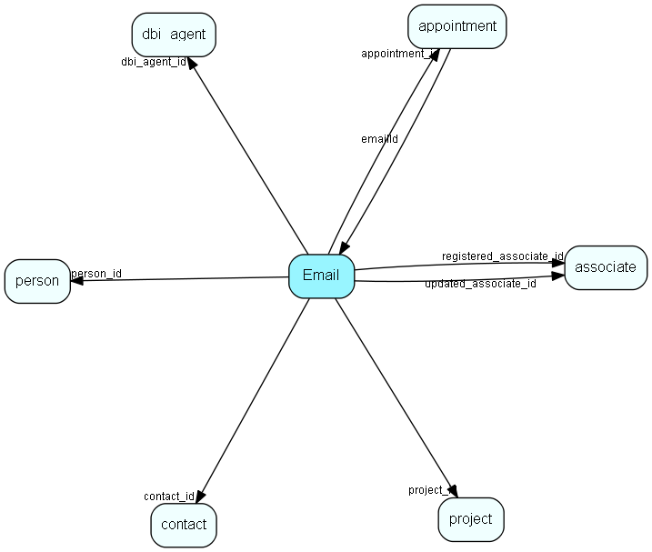

# Email Table (55)

Email addresses for contacts, projects and persons

## Fields

| Name | Description | Type | Null |
|------|-------------|------|:----:|
|email\_id|Primary key|PK| |
|contact\_id|Relations to possible owners|FK [contact](contact.md)|&#x25CF;|
|person\_id|Relations to possible owners|FK [person](person.md)|&#x25CF;|
|project\_id|Relations to possible owners|FK [project](project.md)|&#x25CF;|
|reserved\_id1|Reserved for potential future owners|Id|&#x25CF;|
|reserved\_id2|Reserved for potential future owners|Id|&#x25CF;|
|protocol|SMTP, MSN, Skype, etc|String(11)|&#x25CF;|
|type|0 = email, 1 = chat/instant msg, 2 = voip; see protocol field for more info|Enum [EmailType](enums/emailtype.md)| |
|description|Visible field|String(254)| |
|email\_address|The address itself|String(239)| |
|rank|Rank order in lists|UShort| |
|registered|Registered when|UtcDateTime| |
|registered\_associate\_id|Registered by whom|FK [associate](associate.md)| |
|updated|Last updated when|UtcDateTime| |
|updated\_associate\_id|Last updated by whom|FK [associate](associate.md)| |
|updatedCount|Number of updates made to this record|UShort| |
|bounceCount|Number of bounces detected|UShort|&#x25CF;|
|lastBounce|When did last bounce happen|DateTime|&#x25CF;|
|lastSent|Last transmission (regardless of success/bounce)|DateTime|&#x25CF;|
|dbi\_agent\_id|Integration agent (eJournal)|FK [dbi_agent](dbi-agent.md)|&#x25CF;|
|appointment\_id|The id of the invitation appointment record, used when unknown person is associated with an appointment invitation|FK [appointment](appointment.md)|&#x25CF;|
|lastBounceCode|If this email address has bounced and we have a bounce code, this field will contain the code for the last bounce|Int|&#x25CF;|
|lastBounceReason|If this email address has bounced and we have a bounce reason, this field will contain the reason for the last bounce|String(4000)|&#x25CF;|

[!include[details](./includes/email.md)]

## Indexes

| Fields | Types | Description |
|--------|-------|-------------|
|email\_id |PK |Clustered, Unique |
|contact\_id |FK |Index |
|person\_id |FK |Index |
|project\_id |FK |Index |
|reserved\_id1 |Id |Index |
|reserved\_id2 |Id |Index |
|protocol |String(11) |Index |
|email\_address |String(239) |Index |
|rank |UShort |Index |
|dbi\_agent\_id |FK |Index |
|appointment\_id |FK |Index |

## Relationships

| Table|  Description |
|------|-------------|
|[appointment](appointment.md)  |Tasks, appointments, followups, phone calls; and documents (document_id != 0). An appointment always has a corresponding record in VisibleFor specifying who may see this.  |
|[associate](associate.md)  |Employees, resources and other users - except for External persons |
|[contact](contact.md)  |Companies and Organizations.   This table features a special record containing information about the contact that owns the database.   |
|[dbi\_agent](dbi-agent.md)  |DBI agent settings |
|[person](person.md)  |Persons in a company or an organizations. All associates have a corresponding person record |
|[project](project.md)  |Projects |

## Replication Flags

* Area Management controlled table. Contents replicated to satellites and traveller databases.
* Replicate changes UP from satellites and travellers back to central.
* Copy to satellite and travel prototypes.

## Security Flags

* Sentry controls access to items in this table using user's Role and data rights matrix on the table's parent.

