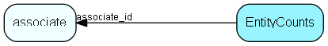

# EntityCounts Table (531)

Number of different entities an associate has created for usage statistics

## Fields

| Name | Description | Type | Null |
|------|-------------|------|:----:|
|entitycounts\_id|Primary key|PK| |
|associate\_id|Associate who created the entity|FK [associate](associate.md)|&#x25CF;|
|entity\_name|The entity measured by this tile|String(255)|&#x25CF;|
|records|Number of related entities an associate has created|Int|&#x25CF;|
|registered|Registered when|UtcDateTime|&#x25CF;|

[!include[details](./includes/entitycounts.md)]

## Indexes

| Fields | Types | Description |
|--------|-------|-------------|
|entitycounts\_id |PK |Clustered, Unique |
|associate\_id, entity\_name |FK, String(255) |Unique |

## Relationships

| Table|  Description |
|------|-------------|
|[associate](associate.md)  |Employees, resources and other users - except for External persons |

## Replication Flags

* None

## Security Flags

* No access control via user's Role.

