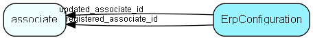

# ErpConfiguration Table (449)

Global settings for the Erp Integration Server

## Fields

| Name | Description | Type | Null |
|------|-------------|------|:----:|
|erpconfiguration\_id|Primary key|PK| |
|ConnectionRank|Semicolon-separated primary keys of ErpConnection records, with &apos;0&apos; representing the SuperOffice &apos;connector&apos;, giving the replication order|String(254)|&#x25CF;|
|SyncInterval|Interval between successive pollings for changes, in seconds|Int|&#x25CF;|
|SyncRunning|Is the sync currently running or not; reflects state of [On] [Off] buttons in the Admin GUI|Bool|&#x25CF;|
|registered|Registered when|UtcDateTime| |
|registered\_associate\_id|Registered by whom|FK [associate](associate.md)| |
|updated|Last updated when|UtcDateTime| |
|updated\_associate\_id|Last updated by whom|FK [associate](associate.md)| |
|updatedCount|Number of updates made to this record|UShort| |

[!include[details](./includes/erpconfiguration.md)]

## Indexes

| Fields | Types | Description |
|--------|-------|-------------|
|erpconfiguration\_id |PK |Clustered, Unique |

## Relationships

| Table|  Description |
|------|-------------|
|[associate](associate.md)  |Employees, resources and other users - except for External persons |

## Replication Flags

* None

## Security Flags

* No access control via user's Role.

