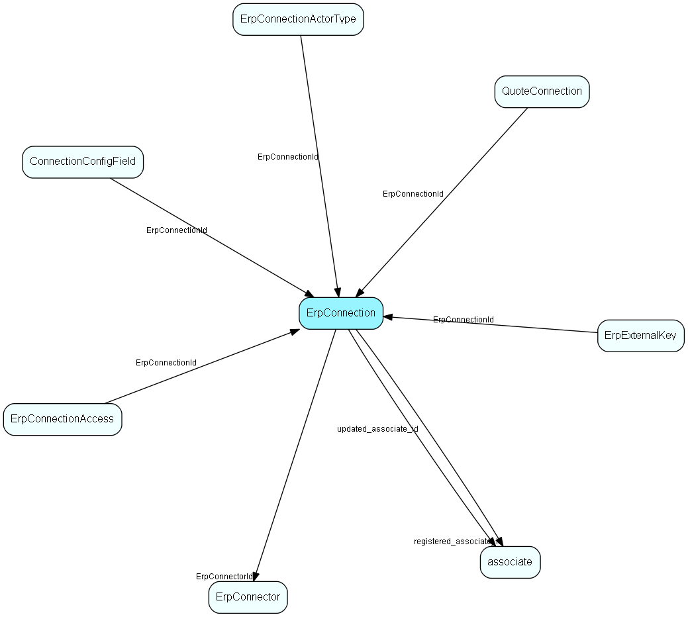

# ErpConnection Table (418)

One connection to an ERP connector, specifying Client and other required information

## Fields

| Name | Description | Type | Null |
|------|-------------|------|:----:|
|erpconnection\_id|Primary key|PK| |
|ErpConnectorId|The connector that this connection should call|FK [ErpConnector](erpconnector.md)|&#x25CF;|
|DisplayName|Connection name shown to user; multi-language support|String(254)|&#x25CF;|
|DisplayDescription|Tooltip/description shown to user; multi-language support|String(254)|&#x25CF;|
|Active|Is this connection currently active|Bool|&#x25CF;|
|ConnectionId|The GUID that uniquely identifies this connection; passed to the Connector in every call|String(127)|&#x25CF;|
|MostRecentTimestamp|Datetime, transaction number or other identification of the point in time of the most-recently seen actor in the ERP system|String(254)|&#x25CF;|
|AllAccess|Is this connection accessible to everyone?  If not, then the ErpConnectionAccess table tells us who can access it|Bool|&#x25CF;|
|Deleted|If set, then this is a row that has been &apos;deleted&apos;; we do not physically delete rows to avoid disaster|Bool|&#x25CF;|
|registered|Registered when|UtcDateTime| |
|registered\_associate\_id|Registered by whom|FK [associate](associate.md)| |
|updated|Last updated when|UtcDateTime| |
|updated\_associate\_id|Last updated by whom|FK [associate](associate.md)| |
|updatedCount|Number of updates made to this record|UShort| |

[!include[details](./includes/erpconnection.md)]

## Indexes

| Fields | Types | Description |
|--------|-------|-------------|
|erpconnection\_id |PK |Clustered, Unique |
|ErpConnectorId |FK |Index |
|ConnectionId |String(127) |Unique |

## Relationships

| Table|  Description |
|------|-------------|
|[associate](associate.md)  |Employees, resources and other users - except for External persons |
|[ConnectionConfigField](connectionconfigfield.md)  |Configuration data for Erp and Quote Connections |
|[ErpConnectionAccess](erpconnectionaccess.md)  |Access control for Erp Connections |
|[ErpConnectionActorType](erpconnectionactortype.md)  |Data about the configuration of one Erp Actor on one ErpConnection |
|[ErpConnector](erpconnector.md)  |One ERP Connector, known by its URL |
|[ErpExternalKey](erpexternalkey.md)  |The external (ERP-facing) key related to a synchronized record / connection |
|[QuoteConnection](quoteconnection.md)  |Primary key in the CRM database. Definition of a connection to an external system, for the Quote system. |

## Replication Flags

* None

## Security Flags

* No access control via user's Role.

