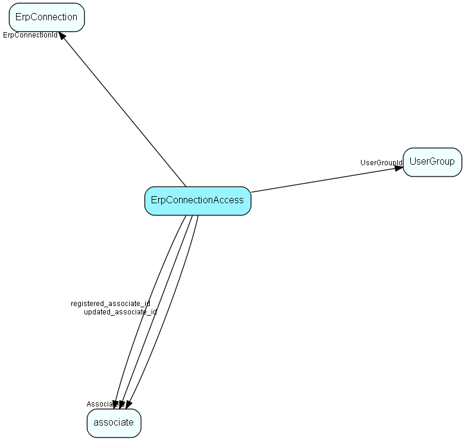

# ErpConnectionAccess Table (420)

Access control for Erp Connections

## Fields

| Name | Description | Type | Null |
|------|-------------|------|:----:|
|erpconnectionaccess\_id|Primary key|PK| |
|ErpConnectionId|Link to Erp connection we&apos;re granting access for|FK [ErpConnection](erpconnection.md)| |
|AssociateId|If set, then this row grants access for a particular associate|FK [associate](associate.md)|&#x25CF;|
|UserGroupId|If set, then this row grants access for a particular group of users|FK [UserGroup](usergroup.md)|&#x25CF;|
|CanConnect|If set, then this user/group is allowed to create and break connections between EXISTING actors in ERP and CRM|Bool|&#x25CF;|
|CanCreateERP|If set, then this user/group is allowed to create NEW actors in ERP and connect them to CRM|Bool|&#x25CF;|
|registered|Registered when|UtcDateTime| |
|registered\_associate\_id|Registered by whom|FK [associate](associate.md)| |
|updated|Last updated when|UtcDateTime| |
|updated\_associate\_id|Last updated by whom|FK [associate](associate.md)| |
|updatedCount|Number of updates made to this record|UShort| |

[!include[details](./includes/erpconnectionaccess.md)]

## Indexes

| Fields | Types | Description |
|--------|-------|-------------|
|erpconnectionaccess\_id |PK |Clustered, Unique |

## Relationships

| Table|  Description |
|------|-------------|
|[associate](associate.md)  |Employees, resources and other users - except for External persons |
|[ErpConnection](erpconnection.md)  |One connection to an ERP connector, specifying Client and other required information |
|[UserGroup](usergroup.md)  |Secondary user groups |

## Replication Flags

* None

## Security Flags

* No access control via user's Role.

