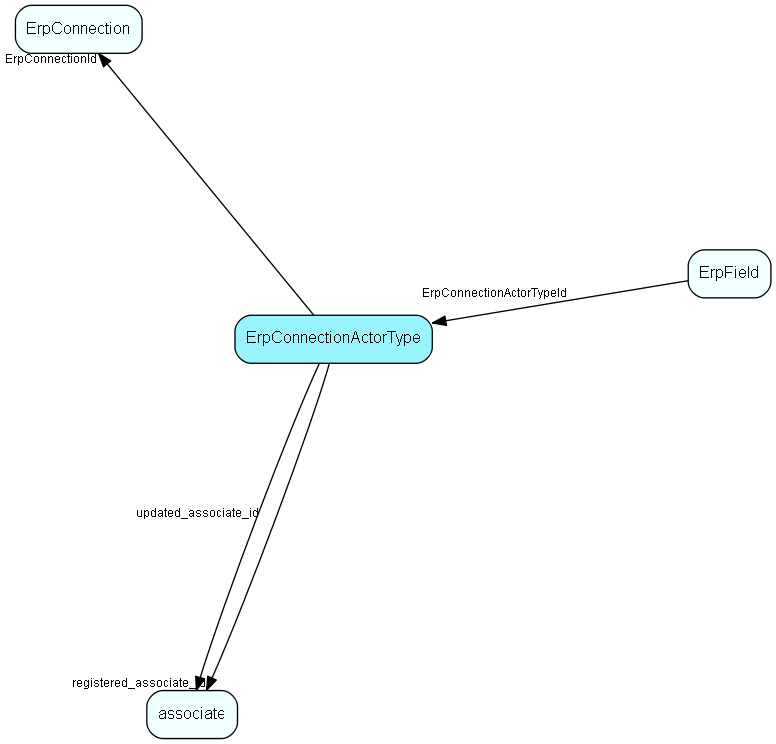

# ErpConnectionActorType Table (419)

Data about the configuration of one Erp Actor on one ErpConnection

## Fields

| Name | Description | Type | Null |
|------|-------------|------|:----:|
|erpconnectionactortype\_id|Primary key|PK| |
|ErpConnectionId|The connection this actor is configured for|FK [ErpConnection](erpconnection.md)| |
|ActorTypeErp|The actor type (ERP side)|Enum [ErpActorType](enums/erpactortype.md)| |
|ActorTypeCrm|The actor type (CRM side)|Enum [CrmActorType](enums/crmactortype.md)|&#x25CF;|
|IsActive|Is this mapping/synchronization configuration currently active|Bool| |
|registered|Registered when|UtcDateTime| |
|registered\_associate\_id|Registered by whom|FK [associate](associate.md)| |
|updated|Last updated when|UtcDateTime| |
|updated\_associate\_id|Last updated by whom|FK [associate](associate.md)| |
|updatedCount|Number of updates made to this record|UShort| |

[!include[details](./includes/erpconnectionactortype.md)]

## Indexes

| Fields | Types | Description |
|--------|-------|-------------|
|erpconnectionactortype\_id |PK |Clustered, Unique |
|ErpConnectionId, ActorTypeErp |FK, Enum |Unique |
|ErpConnectionId, ActorTypeCrm |FK, Enum |Index |

## Relationships

| Table|  Description |
|------|-------------|
|[associate](associate.md)  |Employees, resources and other users - except for External persons |
|[ErpConnection](erpconnection.md)  |One connection to an ERP connector, specifying Client and other required information |
|[ErpField](erpfield.md)  |Store the metadata describing the fields that belong to an actor/connection combination, as described by the Erp Connector |

## Replication Flags

* None

## Security Flags

* No access control via user's Role.

