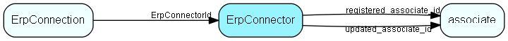

# ErpConnector Table (417)

One ERP Connector, known by its URL

## Fields

| Name | Description | Type | Null |
|------|-------------|------|:----:|
|erpconnector\_id|Primary key|PK| |
|URL|The URL where the connector is located and can be called|String(1023)|&#x25CF;|
|DisplayName|Name shown in the list|String(254)|&#x25CF;|
|Deleted|If set, then this is a row that has been &apos;deleted&apos;; we do not physically delete rows to avoid disaster|Bool|&#x25CF;|
|ConfigXml|Zero or more XML fragments to be added to the .config file, to specify any needed overrides for WCF|Clob|&#x25CF;|
|registered|Registered when|UtcDateTime| |
|registered\_associate\_id|Registered by whom|FK [associate](associate.md)| |
|updated|Last updated when|UtcDateTime| |
|updated\_associate\_id|Last updated by whom|FK [associate](associate.md)| |
|updatedCount|Number of updates made to this record|UShort| |

[!include[details](./includes/erpconnector.md)]

## Indexes

| Fields | Types | Description |
|--------|-------|-------------|
|erpconnector\_id |PK |Clustered, Unique |

## Relationships

| Table|  Description |
|------|-------------|
|[associate](associate.md)  |Employees, resources and other users - except for External persons |
|[ErpConnection](erpconnection.md)  |One connection to an ERP connector, specifying Client and other required information |

## Replication Flags

* None

## Security Flags

* No access control via user's Role.

