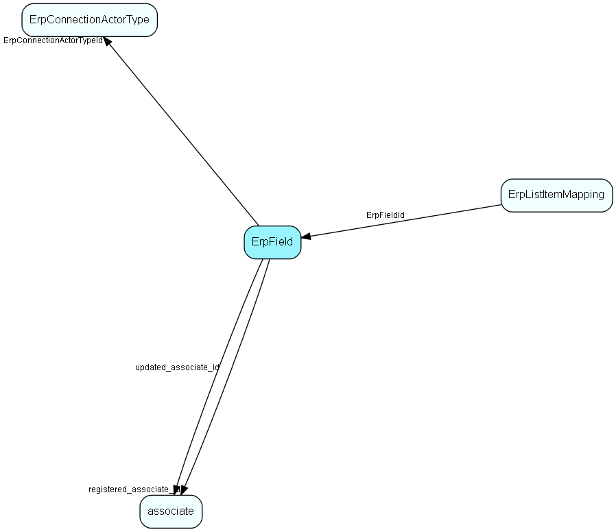

# ErpField Table (425)

Store the metadata describing the fields that belong to an actor/connection combination, as described by the Erp Connector

## Fields

| Name | Description | Type | Null |
|------|-------------|------|:----:|
|erpfield\_id|Primary key|PK| |
|ErpConnectionActorTypeId|Link to Erp Connection/Actor type|FK [ErpConnectionActorType](erpconnectionactortype.md)| |
|ErpFieldKey|The ERP field key|String(254)| |
|DisplayName|Localized field name – shown in the GUI as the label for the control.|String(254)| |
|DisplayDescription|Tooltip for the field name.|String(254)|&#x25CF;|
|FieldType|Field type|Enum [FieldMetadataType](enums/fieldmetadatatype.md)|&#x25CF;|
|ListName|The ERP list name, if the field has a list of values supplied by the ERP Connector|String(254)|&#x25CF;|
|DefaultValue|Default value, stored using CultureDataFormatter format if it is not a string|String(254)|&#x25CF;|
|MaxLength|Maximum size of the field, if there is a limit|Int|&#x25CF;|
|Access|Access restrictions for the field|Enum [FieldAccess](enums/fieldaccess.md)|&#x25CF;|
|HasFirstSyncDefaultValue|Should a default value be set on first sync|Bool|&#x25CF;|
|FirstSyncDefaultValue|The default value to be set, can be blank|String(254)|&#x25CF;|
|PromptUser|Should the field be shown in the first-sync GUI; independent of whether a default value should be set|Bool|&#x25CF;|
|Mandatory|Should the user be forced to set a value (the Erp Connector may declare fields mandatory as well)|Bool|&#x25CF;|
|CrmFieldKey|The CRM field name, as implemented by the Sync entities|String(254)|&#x25CF;|
|SyncToCrm|Should value changes in ERP be automatically transferred to CRM|Bool|&#x25CF;|
|SyncToErp|Should value changes in CRM be automatically transferred to ERP|Bool|&#x25CF;|
|ShowInGui|Should this field be shown as a (read-only!) field in the CRM Gui|Bool|&#x25CF;|
|ShowInSearch|Should this field be shown in searches|Bool|&#x25CF;|
|Rank|Rank order of lines in GUI, relevant if ShowInGui is true|Int|&#x25CF;|
|ListReference|Reference to CRM list, if a mapping exists. Format: table=&lt;table name&gt;[&amp;&lt;extra id&gt;=&lt;value&gt;], to make it independent of actual table numbers|String(254)|&#x25CF;|
|MissingInERP|Set to true if this field has previously been defined, but was no longer in the &apos;supported fields&apos; response from the connector. This typically happens if the target ERP system changes, and means the field needs to be unmapped.|Bool|&#x25CF;|
|registered|Registered when|UtcDateTime| |
|registered\_associate\_id|Registered by whom|FK [associate](associate.md)| |
|updated|Last updated when|UtcDateTime| |
|updated\_associate\_id|Last updated by whom|FK [associate](associate.md)| |
|updatedCount|Number of updates made to this record|UShort| |

[!include[details](./includes/erpfield.md)]

## Indexes

| Fields | Types | Description |
|--------|-------|-------------|
|erpfield\_id |PK |Clustered, Unique |
|ErpConnectionActorTypeId, ErpFieldKey |FK, String(254) |Unique |

## Relationships

| Table|  Description |
|------|-------------|
|[associate](associate.md)  |Employees, resources and other users - except for External persons |
|[ErpConnectionActorType](erpconnectionactortype.md)  |Data about the configuration of one Erp Actor on one ErpConnection |
|[ErpListItemMapping](erplistitemmapping.md)  |Defines a mapping of ERP to CRM fields, per connection and actor type |

## Replication Flags

* None

## Security Flags

* No access control via user's Role.

