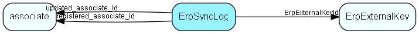

# ErpSyncLog Table (426)

Record all field changes done by the Erp Sync

## Fields

| Name | Description | Type | Null |
|------|-------------|------|:----:|
|erpsynclog\_id|Primary key|PK| |
|ErpExternalKeyId|Link to the external key, indirectly also to the connection and internal key|FK [ErpExternalKey](erpexternalkey.md)|&#x25CF;|
|ErpFieldKey|ERP field name/key|String(254)|&#x25CF;|
|CrmFieldKey|CRM field name/key|String(254)|&#x25CF;|
|TargetIsCrm|Was the CRM field the target of the change? If false, then it was the ERP field that was changed by this sync operation|Bool|&#x25CF;|
|OldValue|The old value of the target field|String(254)|&#x25CF;|
|NewValue|The new value of the target field|String(254)|&#x25CF;|
|registered|Registered when|UtcDateTime| |
|registered\_associate\_id|Registered by whom|FK [associate](associate.md)| |
|updated|Last updated when|UtcDateTime| |
|updated\_associate\_id|Last updated by whom|FK [associate](associate.md)| |
|updatedCount|Number of updates made to this record|UShort| |

[!include[details](./includes/erpsynclog.md)]

## Indexes

| Fields | Types | Description |
|--------|-------|-------------|
|erpsynclog\_id |PK |Clustered, Unique |

## Relationships

| Table|  Description |
|------|-------------|
|[associate](associate.md)  |Employees, resources and other users - except for External persons |
|[ErpExternalKey](erpexternalkey.md)  |The external (ERP-facing) key related to a synchronized record / connection |

## Replication Flags

* None

## Security Flags

* No access control via user's Role.

