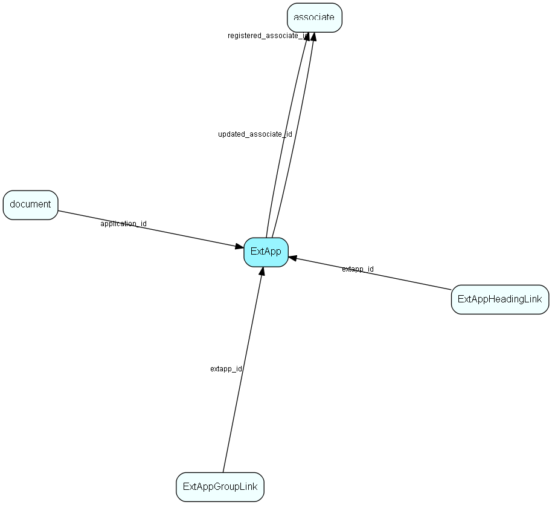

# ExtApp Table (133)

ExtApp MDO list item table.
ExtApp list table. Applications startable from SuperOffice

## Fields

| Name | Description | Type | Null |
|------|-------------|------|:----:|
|ExtApp\_id|Primary key|PK| |
|name|The list item|String(239)| |
|rank|Rank order|UShort|&#x25CF;|
|tooltip|Tooltip or other description|String(254)|&#x25CF;|
|deleted|0 -&gt; record is active 1 -&gt; record is &apos;deleted&apos; and should not be shown in lists|UShort|&#x25CF;|
|path|Path where the programfile is located; if empty, PATH is used|String(239)|&#x25CF;|
|filename|Filename of the programfile|String(239)| |
|parameters|&lt;template variable&gt; &lt;other template variable&gt;|String(239)|&#x25CF;|
|workdir|Directory set to current when loading the application, if different from application&apos;s own|String(239)|&#x25CF;|
|icon|0 indicates default Icon (from app exe file), otherwise reference to a predefined icon resource in SO|UShort|&#x25CF;|
|availableInState|When should this application be available from SO: 0=always, 1=on central db, 2=on travel db,4 on satellite. The value 5 (1+4) indicates that this application is available when logged in to a central or satellite db|Enum [AppAvailState](enums/appavailstate.md)| |
|executeOnEvent|Events that cause automatic execution of this app|Enum [ExecuteOnEvent](enums/executeonevent.md)| |
|navigation|0=from menu, 1 = from Navigator(integration), 2 = From navigator|Enum [Navigation](enums/navigation.md)| |
|showState|Maximized / minimized / restored|Enum [ShowState](enums/showstate.md)| |
|registered|Registered when|UtcDateTime| |
|registered\_associate\_id|Registered by whom|FK [associate](associate.md)| |
|updated|Last updated when|UtcDateTime| |
|updated\_associate\_id|Last updated by whom|FK [associate](associate.md)| |
|updatedCount|Number of updates made to this record|UShort| |
|appType|Application type: 1 = exe, 2 = integrated html, 3 = integrated url, 4 = browser url, 5 = external url|Enum [AppType](enums/apptype.md)|&#x25CF;|
|waitToFinish|If 1, we wait synchronously for the pplication to finish before we go on|Bool|&#x25CF;|
|windowName|The window which the URL address is to open in (webpanel only)|String(254)|&#x25CF;|
|url1|URL, supports long strings up to 1k|String(1023)|&#x25CF;|
|url2|Obsolete - do not use this field|String(254)|&#x25CF;|
|configInfo|Extra configuration information|String(2047)|&#x25CF;|

[!include[details](./includes/extapp.md)]

## Indexes

| Fields | Types | Description |
|--------|-------|-------------|
|ExtApp\_id |PK |Clustered, Unique |
|name |String(239) |Unique |

## Relationships

| Table|  Description |
|------|-------------|
|[associate](associate.md)  |Employees, resources and other users - except for External persons |
|[document](document.md)  |Documents, this table is an extension of the Appointment table.  There is always a corresponding appointment record; the relation between appointment and document is navigable in both directions. A document-type appointment record always has a corresponding document record and a record in VisibleFor specifying who may see this.   |
|[ExtAppGroupLink](extappgrouplink.md)  |User group link table for ExtApp, for MDO item hiding |
|[ExtAppHeadingLink](extappheadinglink.md)  |Heading link table for ExtApp, for MDO headers |

## Replication Flags

* Replicate changes DOWN from central to satellites and travellers.
* Replicate changes UP from satellites and travellers back to central.
* Copy to satellite and travel prototypes.

## Security Flags

* No access control via user's Role.

