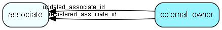

# external\_owner Table (488)

Owner of external data imported into the system

## Fields

| Name | Description | Type | Null |
|------|-------------|------|:----:|
|external\_owner\_id|Primary key|PK| |
|owner|The owner of this row|Enum [ExternalOwner](enums/externalowner.md)| |
|sourceKey|A string in the owner chosen format to uniqly indicate the source of this record|String(512)| |
|targetTable|The table the record is written to|TableNumber| |
|targetRecord|The record id of the written record|RecordId| |
|checksum|Optional checksum of data to detect tampering|String(4000)|&#x25CF;|
|registered|Registered when|UtcDateTime| |
|registered\_associate\_id|Registered by whom|FK [associate](associate.md)| |
|updated|Last updated when|UtcDateTime| |
|updated\_associate\_id|Last updated by whom|FK [associate](associate.md)| |
|updatedCount|Number of updates made to this record|UShort| |

[!include[details](./includes/external-owner.md)]

## Indexes

| Fields | Types | Description |
|--------|-------|-------------|
|external\_owner\_id |PK |Clustered, Unique |
|owner |Enum |Index |
|sourceKey |String(512) |Index |

## Relationships

| Table|  Description |
|------|-------------|
|[associate](associate.md)  |Employees, resources and other users - except for External persons |

## Replication Flags

* None

## Security Flags

* No access control via user's Role.

