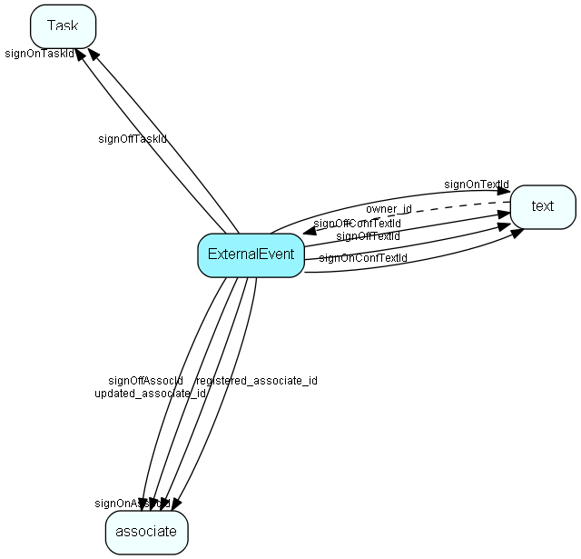

# ExternalEvent Table (233)

The definition of projects as events in Audience (or other Collaborative apps)

## Fields

| Name | Description | Type | Null |
|------|-------------|------|:----:|
|ExternalEvent\_id|Primary key|PK| |
|eventEnabled|Is the event enabled|Bool| |
|eventDate|Dateof the event; publishing/visibility dates are in Publish, and restrictions are in AudienceVisibility|DateTime| |
|parentTable|The thing, that has now become an Event|TableNumber| |
|parentRecord|The thing, that has now become an Event|RecordId| |
|signOn|Is Sign On functionality enabled|Bool| |
|signOnTaskEnable|If not 0, a task should be created when the external user Signs On to an event|Bool| |
|signOnTaskId|If not 0, sign on should cause an Activity of this type to be registered|FK [Task](task.md)| |
|signOnAssocId|If 0, the signOn Activity should go into the persons Our Contact; if not 0, this is the Associate whose diary should get the activity|FK [associate](associate.md)| |
|signOnTextId|If not 0, the given text should be entered into the appointment|FK [text](text.md)| |
|signOnConfTextId|If not 0, the given text should be shown as a confirmation text before accpting Sign On|FK [text](text.md)| |
|signOnTriggersAssign|If 1, the SignOn task should be created as an Assigned task, triggering the invitation dialog|Bool| |
|signOff|Is Sign Off functionality enabled|Bool| |
|signOffTaskEnable|If not 0, a task should be created when the external user Signs Off an event|Bool| |
|signOffTaskId|If not 0, sign off should cause an Activity of this type to be registered|FK [Task](task.md)| |
|signOffAssocId|If 0, the signOn Activity should go into the persons Our Contact; if not 0, this is the Associate whose diary should get the activity|FK [associate](associate.md)| |
|signOffTextId|If not 0, the given text should be shown as a confirmation text before accpting Sign Off|FK [text](text.md)| |
|signOffConfTextId|If not 0, the given text should be shown as a confirmation text before accpting Sign Off|FK [text](text.md)| |
|signOffTriggersAssign|If 1, the SignOff task should be created as an Assigned task, triggering the invitation dialog|Bool| |
|registered|Registered when|UtcDateTime| |
|registered\_associate\_id|Registered by whom|FK [associate](associate.md)| |
|updated|Last updated when|UtcDateTime| |
|updated\_associate\_id|Last updated by whom|FK [associate](associate.md)| |
|updatedCount|Number of updates made to this record|UShort| |

[!include[details](./includes/externalevent.md)]

## Indexes

| Fields | Types | Description |
|--------|-------|-------------|
|ExternalEvent\_id |PK |Clustered, Unique |
|eventEnabled |Bool |Index |
|eventDate |DateTime |Index |
|parentTable |TableNumber |Index |
|parentRecord |RecordId |Index |

## Relationships

| Table|  Description |
|------|-------------|
|[associate](associate.md)  |Employees, resources and other users - except for External persons |
|[Task](task.md)  |Task list table, activity types, like Phone, Meeting |
|[text](text.md)  |Long text fields from all over the system |

## Replication Flags

* Replicate changes DOWN from central to satellites and travellers.
* Replicate changes UP from satellites and travellers back to central.
* Copy to satellite and travel prototypes.

## Security Flags

* No access control via user's Role.

