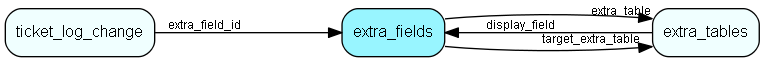

# extra\_fields Table (304)

This table contains entries for the extra fields in the system.

## Fields

| Name | Description | Type | Null |
|------|-------------|------|:----:|
|id|The primary key (auto-incremented)|PK| |
|domain|Enum indicating for what table this is an extra field (ticket, customer, company, etc).|domain|&#x25CF;|
|extra\_table|The reference to the extra_table if this table is related to an extra_table. NULL or -1 if not set.|FK [extra_tables](extra-tables.md)|&#x25CF;|
|target\_extra\_table|If this extra field is a extra table relation, then this is the id of the extra table this entry *points* to.|FK [extra_tables](extra-tables.md)|&#x25CF;|
|field\_name|The database name of this extra field.|String(64)|&#x25CF;|
|name|The name of this extra field.|String(128)|&#x25CF;|
|default\_value|The default value of this extra field.|String(255)|&#x25CF;|
|type|Enum indicating the type for this extra field (string, int, date, etc).|type|&#x25CF;|
|flags|A bitmask for flags for this extra field.|Int|&#x25CF;|
|params|A string contaning various parameters for this extra field, stored in an arbitrary format.|Clob|&#x25CF;|
|order\_pos|Used to order elements when listed.|Int|&#x25CF;|
|description|Optional description of what this field is used for.|String(2047)|&#x25CF;|

[!include[details](./includes/extra-fields.md)]

## Indexes

| Fields | Types | Description |
|--------|-------|-------------|
|id |PK |Clustered, Unique |
|extra\_table |FK |Index |
|target\_extra\_table |FK |Index |

## Relationships

| Table|  Description |
|------|-------------|
|[extra\_tables](extra-tables.md)  |This table contains entries for the extra tables in the system. |
|[ticket\_log\_change](ticket-log-change.md)  |This table contains log entries for the tickets. |

## Replication Flags

* None

## Security Flags

* No access control via user's Role.

