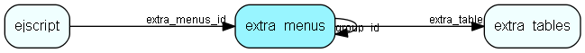

# extra\_menus Table (307)

This table contains entries for the extra menus in the system.

## Fields

| Name | Description | Type | Null |
|------|-------------|------|:----:|
|id|The primary key (auto-incremented)|PK| |
|screen|Enum indicating for what screen this is an extra menu (listTicket, listCustomer, main, etc).|screen|&#x25CF;|
|label|The label for this menu.|String(128)|&#x25CF;|
|url|The url for this menu.|String(255)|&#x25CF;|
|target|The target for this url.|String(255)|&#x25CF;|
|icon\_url|The icon url for this menu.|String(255)|&#x25CF;|
|extra\_info|Field used for various extra information depending on menu type|String(255)|&#x25CF;|
|order\_pos|Used to order elements when listed.|Int|&#x25CF;|
|flags|Flags|UInt|&#x25CF;|
|base\_program|Base program used in url (ticket, rms, ...)|base_program|&#x25CF;|
|extra\_table|ExtraTable that the menu is connected to|FK [extra_tables](extra-tables.md)|&#x25CF;|
|group\_id|Link to extra_menus table if this menu item is to be shown in a custom menu group|FK [extra_menus](extra-menus.md)|&#x25CF;|

[!include[details](./includes/extra-menus.md)]

## Indexes

| Fields | Types | Description |
|--------|-------|-------------|
|id |PK |Clustered, Unique |
|extra\_table |FK |Index |

## Relationships

| Table|  Description |
|------|-------------|
|[ejscript](ejscript.md)  |ejscript |
|[extra\_menus](extra-menus.md)  |This table contains entries for the extra menus in the system. |
|[extra\_tables](extra-tables.md)  |This table contains entries for the extra tables in the system. |

## Replication Flags

* None

## Security Flags

* No access control via user's Role.

