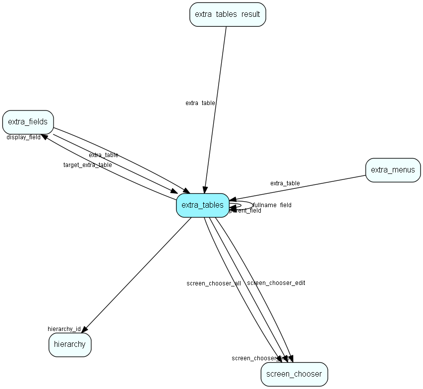

# extra\_tables Table (305)

This table contains entries for the extra tables in the system.

## Fields

| Name | Description | Type | Null |
|------|-------------|------|:----:|
|id|The primary key (auto-incremented)|PK| |
|table\_name|The database name of this extra table.|String(64)|&#x25CF;|
|name|The name of this extra table.|String(128)|&#x25CF;|
|search\_header|The header when searching this table.|String(255)|&#x25CF;|
|view\_entry\_header|The header when viewing entries in this table.|String(255)|&#x25CF;|
|new\_entry\_header|The header when creating a new entry in this table.|String(255)|&#x25CF;|
|edit\_entry\_header|The header when editing an entry in this table.|String(255)|&#x25CF;|
|hierarchy\_id|This extra table is inside this hierarchy folder|FK [hierarchy](hierarchy.md)| |
|sort\_order|The default sort_order for this extra table.|String(255)|&#x25CF;|
|display\_field|The default field to display for this extra table.|FK [extra_fields](extra-fields.md)|&#x25CF;|
|flags|Bitmap for flags for this entry.|UInt|&#x25CF;|
|parent\_field|If this table is hierarchically organized, then this field can contain a field which is a parent-field, creating a hierarchy.|FK [extra_tables](extra-tables.md)|&#x25CF;|
|fullname\_field|If this table is hierarchically organized, then this field can contain a field which will be assigned a fullname, such as &amp;apos;Support/Hardware/Keyboards&amp;apos;.|FK [extra_tables](extra-tables.md)|&#x25CF;|
|screen\_chooser\_entry|The screen chooser to use for this extra table when viewing an entry.|FK [screen_chooser](screen-chooser.md)|&#x25CF;|
|screen\_chooser\_all|The screen chooser to use for this extra table when viewing the table.|FK [screen_chooser](screen-chooser.md)|&#x25CF;|
|screen\_chooser\_edit|The screen chooser to use for this extra table when editing the table.|FK [screen_chooser](screen-chooser.md)|&#x25CF;|
|description|Optional description of what this table is used for|String(2047)|&#x25CF;|
|icon\_id|The id of the binary object entry|FK [BinaryObject](binaryobject.md)|&#x25CF;|

[!include[details](./includes/extra-tables.md)]

## Indexes

| Fields | Types | Description |
|--------|-------|-------------|
|id |PK |Clustered, Unique |
|hierarchy\_id |FK |Index |
|display\_field |FK |Index |
|parent\_field |FK |Index |
|fullname\_field |FK |Index |
|screen\_chooser\_entry |FK |Index |
|screen\_chooser\_all |FK |Index |
|screen\_chooser\_edit |FK |Index |

## Relationships

| Table|  Description |
|------|-------------|
|[BinaryObject](binaryobject.md)  |Binary objects, i.e., blobs. Used for images, documents, SuperOffice inbox mail  and other large binary items |
|[extra\_fields](extra-fields.md)  |This table contains entries for the extra fields in the system. |
|[extra\_menus](extra-menus.md)  |This table contains entries for the extra menus in the system. |
|[extra\_tables](extra-tables.md)  |This table contains entries for the extra tables in the system. |
|[extra\_tables\_result](extra-tables-result.md)  |Result set of executed search in ejournal extra tables |
|[hierarchy](hierarchy.md)  |This table contains folders used to group the extra tables in the system. |
|[screen\_chooser](screen-chooser.md)  |Screen choosers |

## Replication Flags

* None

## Security Flags

* No access control via user's Role.

