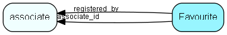

# Favourite Table (455)

Favourite records (star-marking)

## Fields

| Name | Description | Type | Null |
|------|-------------|------|:----:|
|Favourite\_id|Primary key|PK| |
|table\_id|SuperOffice table reference|TableNumber| |
|record\_id|Record in the referenced table|RecordId| |
|associate\_id|The user who has marked this favourited|FK [associate](associate.md)|&#x25CF;|
|extra\_info|Optional extra information|String(254)|&#x25CF;|
|registered|Registered datetime|DateTime|&#x25CF;|
|registered\_by|Registered by whom|FK [associate](associate.md)|&#x25CF;|
|Rank|Rank order|Int|&#x25CF;|

[!include[details](./includes/favourite.md)]

## Indexes

| Fields | Types | Description |
|--------|-------|-------------|
|Favourite\_id |PK |Clustered, Unique |
|record\_id, associate\_id, table\_id |RecordId, FK, TableNumber |Index |

## Relationships

| Table|  Description |
|------|-------------|
|[associate](associate.md)  |Employees, resources and other users - except for External persons |

## Replication Flags

* Replicate changes DOWN from central to satellites and travellers.
* Replicate changes UP from satellites and travellers back to central.
* Copy to satellite and travel prototypes.

## Security Flags

* No access control via user's Role.

