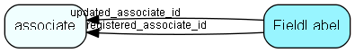

# FieldLabel Table (168)

Field label override table, makes it possible to override internal string resources. Define your own text for the panels in SuperOffice, e.g. rename Project to Cars in SOAdmin - System Options - Labels  This table contains controlling data for the string substitution mechanism. There is one row in this table for each label or string that can be substituted; the active field indicates whether the string is actually being substituted or not. Initially, all rows have this field set to 0. The table is loaded with initial data during database setup.  Only SuperOffice Development has the necessary expertise to safely add rows to this table.  If a row has active = 1, the table LocaleText should contain one or more rows pointing back to this table, with the actual text to be used. 

## Fields

| Name | Description | Type | Null |
|------|-------------|------|:----:|
|FieldLabel\_id|Primary key|PK| |
|resourceId|Text resource ID|Id| |
|parentId|ID (not resource) of label that is a parent of this one|Id|&#x25CF;|
|active|1 = label substitution is active|UShort|&#x25CF;|
|registered|Registered when|UtcDateTime| |
|registered\_associate\_id|Registered by whom|FK [associate](associate.md)| |
|updated|Last updated when|UtcDateTime| |
|updated\_associate\_id|Last updated by whom|FK [associate](associate.md)| |
|updatedCount|Number of updates made to this record|UShort| |

[!include[details](./includes/fieldlabel.md)]

## Indexes

| Fields | Types | Description |
|--------|-------|-------------|
|FieldLabel\_id |PK |Clustered, Unique |
|resourceId |Id |Index |

## Relationships

| Table|  Description |
|------|-------------|
|[associate](associate.md)  |Employees, resources and other users - except for External persons |

## Replication Flags

* Replicate changes DOWN from central to satellites and travellers.
* Replicate changes UP from satellites and travellers back to central.
* Copy to satellite and travel prototypes.

## Security Flags

* No access control via user's Role.

