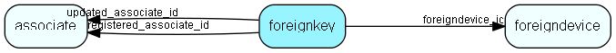

# foreignkey Table (183)

Foreign Key - enables storage of arbitrary extra key information for every table/row in SuperOffice. You may use this table to store your extra information instead of using the dictionary SDK to create your own tables.

## Fields

| Name | Description | Type | Null |
|------|-------------|------|:----:|
|foreignkey\_id|Primary key|PK| |
|foreigndevice\_id|Reference to device definition|FK [foreigndevice](foreigndevice.md)| |
|table\_id|SuperOffice table reference|TableNumber| |
|record\_id|Record in the referenced table|RecordId| |
|seqno|Sequence number, order of subkeys within one key|Id| |
|subkey|Subkey (optional)|String(239)|&#x25CF;|
|subvalue|Key value|String(239)|&#x25CF;|
|registered|Registered when|UtcDateTime| |
|registered\_associate\_id|Registered by whom|FK [associate](associate.md)| |
|updated|Last updated when|UtcDateTime| |
|updated\_associate\_id|Last updated by whom|FK [associate](associate.md)| |
|updatedCount|Number of updates made to this record|UShort| |

[!include[details](./includes/foreignkey.md)]

## Indexes

| Fields | Types | Description |
|--------|-------|-------------|
|foreignkey\_id |PK |Clustered, Unique |
|foreigndevice\_id |FK |Index |
|record\_id |RecordId |Index |
|seqno |Id |Index |
|subkey |String(239) |Index |
|subvalue |String(239) |Index |

## Relationships

| Table|  Description |
|------|-------------|
|[associate](associate.md)  |Employees, resources and other users - except for External persons |
|[foreigndevice](foreigndevice.md)  |Middle level of Foreign Key system |

## Replication Flags

* Replicate changes DOWN from central to satellites and travellers.
* Replicate changes UP from satellites and travellers back to central.
* Copy to satellite and travel prototypes.

## Security Flags

* No access control via user's Role.

