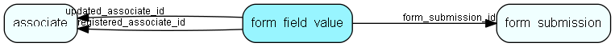

# form\_field\_value Table (522)

Form field values saved in a searchable format

## Fields

| Name | Description | Type | Null |
|------|-------------|------|:----:|
|form\_field\_value\_id|Primary key|PK| |
|form\_submission\_id|The form submission this set of values belong to|FK [form_submission](form-submission.md)|&#x25CF;|
|rank|The rank of this form field within the form|Int|&#x25CF;|
|label|The label of this form field|String(4000)|&#x25CF;|
|type|The type of this form field|String(4000)|&#x25CF;|
|sequence|The sequence of this form field|Int|&#x25CF;|
|string\_value|The string value of this form field|String(4000)|&#x25CF;|
|int\_value|The integer value of this form field|Int|&#x25CF;|
|double\_value|The double value of this form field|Double|&#x25CF;|
|bool\_value|The boolean value of this form field|Bool|&#x25CF;|
|datetime\_value|The datetime value of this form field|DateTime|&#x25CF;|
|registered|Registered when|UtcDateTime| |
|registered\_associate\_id|Registered by whom|FK [associate](associate.md)| |
|updated|Last updated when|UtcDateTime| |
|updated\_associate\_id|Last updated by whom|FK [associate](associate.md)| |
|updatedCount|Number of updates made to this record|UShort| |

[!include[details](./includes/form-field-value.md)]

## Indexes

| Fields | Types | Description |
|--------|-------|-------------|
|form\_field\_value\_id |PK |Clustered, Unique |
|form\_submission\_id |FK |Index |
|label |String(4000) |Index |
|type |String(4000) |Index |
|sequence |Int |Index |
|string\_value |String(4000) |Index |
|int\_value |Int |Index |
|double\_value |Double |Index |
|bool\_value |Bool |Index |
|datetime\_value |DateTime |Index |

## Relationships

| Table|  Description |
|------|-------------|
|[associate](associate.md)  |Employees, resources and other users - except for External persons |
|[form\_submission](form-submission.md)  |A form submission |

## Replication Flags

* None

## Security Flags

* No access control via user's Role.

