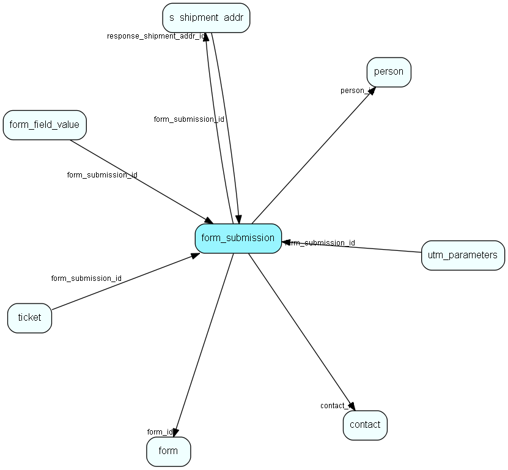

# form\_submission Table (485)

A form submission

## Fields

| Name | Description | Type | Null |
|------|-------------|------|:----:|
|form\_submission\_id|Primary key|PK| |
|form\_id|The id of the parent form.|FK [form](form.md)| |
|when\_submitted|The time of the submit.|DateTime|&#x25CF;|
|contact\_id|The optional id of the contact of the person who submitted.|FK [contact](contact.md)| |
|person\_id|The optional id of the person who submitted.|FK [person](person.md)| |
|email\_address|The email address of the person who submitted|String(255)|&#x25CF;|
|response\_shipment\_addr\_id|The id of the s_shipment_addr that is the response mail|FK [s_shipment_addr](s-shipment-addr.md)| |
|response|The JSON-formatted response from this form|Clob|&#x25CF;|
|status|What is the status of this submission|Enum [FormSubmissionStatus](enums/formsubmissionstatus.md)| |
|processing\_log|A log of what happened during processing|String(4000)|&#x25CF;|

[!include[details](./includes/form-submission.md)]

## Indexes

| Fields | Types | Description |
|--------|-------|-------------|
|form\_submission\_id |PK |Clustered, Unique |
|form\_id |FK |Index |
|contact\_id |FK |Index |
|person\_id |FK |Index |
|response\_shipment\_addr\_id |FK |Index |

## Relationships

| Table|  Description |
|------|-------------|
|[contact](contact.md)  |Companies and Organizations.   This table features a special record containing information about the contact that owns the database.   |
|[form](form.md)  |A form which can be published on a webpage and submitted by visitors |
|[form\_field\_value](form-field-value.md)  |Form field values saved in a searchable format |
|[person](person.md)  |Persons in a company or an organizations. All associates have a corresponding person record |
|[s\_shipment\_addr](s-shipment-addr.md)  |Addresses that are ready to be sent in a shipment. |
|[ticket](ticket.md)  |This table contains the tickets (requests) of the system. Its purpose should be evident. |

## Replication Flags

* None

## Security Flags

* No access control via user's Role.

