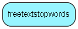

# freetextstopwords Table (44)

Here are the words that can be excluded from Free Text Search by using the FreeTextAdmin. The words that appear here will not be found in FreeTextWords and typically include &quot;are&quot;, &quot;this&quot;, &quot;that&quot;, and so on - words that occur frequently, but are not useful for searching.  The more (good) stop words you have, the smaller the index will be.

## Fields

| Name | Description | Type | Null |
|------|-------------|------|:----:|
|freetextwords\_id|Primary key|PK| |
|word|Stop word, not to be indexed|String(19)| |

[!include[details](./includes/freetextstopwords.md)]

## Indexes

| Fields | Types | Description |
|--------|-------|-------------|
|freetextwords\_id |PK |Unique |
|word |String(19) |Clustered |

## Replication Flags

* Copy to satellite and travel prototypes.

## Security Flags

* No access control via user's Role.

