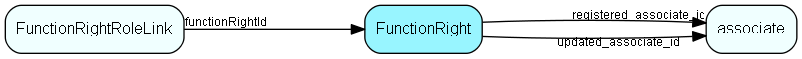

# FunctionRight Table (193)

Functional right definition

## Fields

| Name | Description | Type | Null |
|------|-------------|------|:----:|
|FunctionRight\_id|Primary key|PK| |
|name|Readable, internal ID (not a GUI text)|String(254)| |
|rightType|0 = functional right|Enum [FunctionRightType](enums/functionrighttype.md)| |
|isBuiltIn|0 = added by partner, 1 = supplied by SuperOffice|Bool| |
|encryptedCheck|Encrypted data, to detect unwanted changes|String(254)| |
|requiredModule|If non-blank, specifies a module license that is also needed, for this right to be granted|String(239)|&#x25CF;|
|registered|Registered when|UtcDateTime| |
|registered\_associate\_id|Registered by whom|FK [associate](associate.md)| |
|updated|Last updated when|UtcDateTime| |
|updated\_associate\_id|Last updated by whom|FK [associate](associate.md)| |
|updatedCount|Number of updates made to this record|UShort| |

[!include[details](./includes/functionright.md)]

## Indexes

| Fields | Types | Description |
|--------|-------|-------------|
|FunctionRight\_id |PK |Clustered, Unique |

## Relationships

| Table|  Description |
|------|-------------|
|[associate](associate.md)  |Employees, resources and other users - except for External persons |
|[FunctionRightRoleLink](functionrightrolelink.md)  |Functional right definition |

## Replication Flags

* Replicate changes DOWN from central to satellites and travellers.
* Replicate changes UP from satellites and travellers back to central.
* Copy to satellite and travel prototypes.

## Security Flags

* No access control via user's Role.

