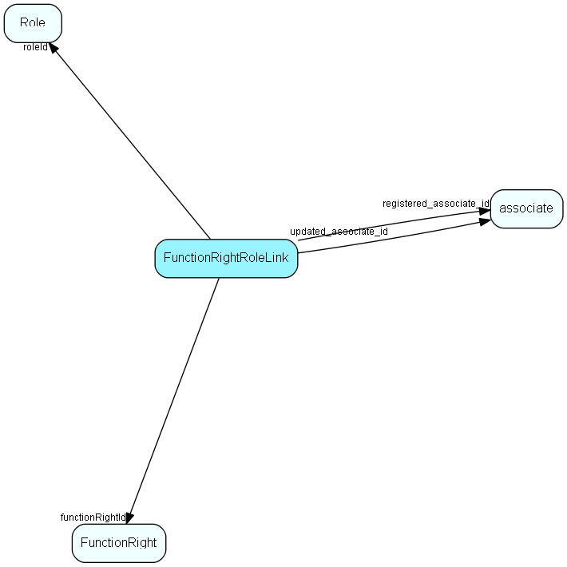

# FunctionRightRoleLink Table (194)

Functional right definition

## Fields

| Name | Description | Type | Null |
|------|-------------|------|:----:|
|FunctionRightRoleLink\_id|Primary key|PK| |
|roleId|Role id|FK [Role](role.md)| |
|functionRightId|Functional right id|FK [FunctionRight](functionright.md)| |
|encryptedCheck|Encrypted data, to detect unwanted changes|String(254)| |
|registered|Registered when|UtcDateTime| |
|registered\_associate\_id|Registered by whom|FK [associate](associate.md)| |
|updated|Last updated when|UtcDateTime| |
|updated\_associate\_id|Last updated by whom|FK [associate](associate.md)| |
|updatedCount|Number of updates made to this record|UShort| |

[!include[details](./includes/functionrightrolelink.md)]

## Indexes

| Fields | Types | Description |
|--------|-------|-------------|
|FunctionRightRoleLink\_id |PK |Clustered, Unique |
|roleId |FK |Index |
|functionRightId |FK |Index |
|roleId, functionRightId |FK, FK |Index |

## Relationships

| Table|  Description |
|------|-------------|
|[associate](associate.md)  |Employees, resources and other users - except for External persons |
|[FunctionRight](functionright.md)  |Functional right definition |
|[Role](role.md)  |User roles for role-based security, names and tooltips are in LocaleText. For more information regarding role based security, see http://techdoc.superoffice.com |

## Replication Flags

* Replicate changes DOWN from central to satellites and travellers.
* Replicate changes UP from satellites and travellers back to central.
* Copy to satellite and travel prototypes.

## Security Flags

* No access control via user's Role.

