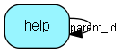

# help Table (302)

This table contains the help pages.

## Fields

| Name | Description | Type | Null |
|------|-------------|------|:----:|
|id|The primary key (auto-incremented)|PK| |
|name|The name for this help page.|String(64)|&#x25CF;|
|title|The title for this help page.|String(255)|&#x25CF;|
|parent\_id|The id of the parent help page. NULL or -1 if this is a toplevel helppage.|FK [help](help.md)|&#x25CF;|
|language|A string indicating the language for this helppage (&amp;apos;no&amp;apos; or &amp;apos;en&amp;apos;).|String(5)|&#x25CF;|
|sort\_order|The sort-order for this helppage when listed among its siblings.|Int|&#x25CF;|
|module\_id|The id of the module, if this page is the description for a module..|Int| |
|application\_area\_id|The id of the application_area, if this page is the description for a application_area..|Int| |
|screen\_id|The id of the screen, if this page is the description for a screen..|Int| |
|body|The actual body for the helppage. HTML format.|Clob|&#x25CF;|

[!include[details](./includes/help.md)]

## Indexes

| Fields | Types | Description |
|--------|-------|-------------|
|id |PK |Clustered, Unique |
|parent\_id |FK |Index |
|module\_id |Int |Index |
|application\_area\_id |Int |Index |
|screen\_id |Int |Index |

## Relationships

| Table|  Description |
|------|-------------|
|[help](help.md)  |This table contains the help pages. |

## Replication Flags

* None

## Security Flags

* No access control via user's Role.

