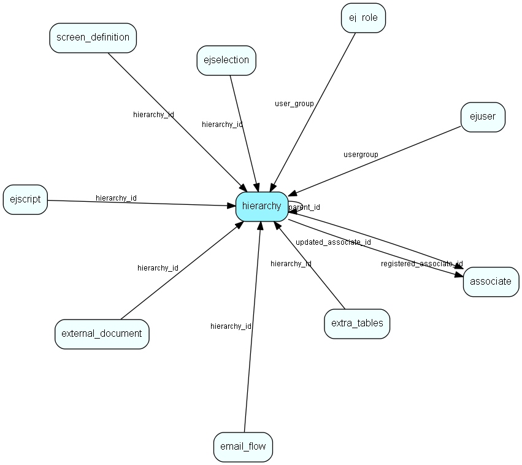

# hierarchy Table (306)

This table contains folders used to group the extra tables in the system.

## Fields

| Name | Description | Type | Null |
|------|-------------|------|:----:|
|id|The primary key (auto-incremented)|PK| |
|domain|Domain seperating the different hierarchy|Int| |
|parent\_id|Parent table|FK [hierarchy](hierarchy.md)| |
|name|Name of this hierarchy folder.|String(128)| |
|fullname|The full name of this category, i.e. Foo/bar/test.|Clob|&#x25CF;|
|registered|Registered when|UtcDateTime|&#x25CF;|
|registered\_associate\_id|Registered by whom|FK [associate](associate.md)|&#x25CF;|
|updated|Last updated when|UtcDateTime|&#x25CF;|
|updated\_associate\_id|Last updated by whom|FK [associate](associate.md)|&#x25CF;|
|updatedCount|Number of updates made to this record|UShort|&#x25CF;|

[!include[details](./includes/hierarchy.md)]

## Indexes

| Fields | Types | Description |
|--------|-------|-------------|
|id |PK |Clustered, Unique |
|domain |Int |Index |
|parent\_id |FK |Index |
|name |String(128) |Index |

## Relationships

| Table|  Description |
|------|-------------|
|[associate](associate.md)  |Employees, resources and other users - except for External persons |
|[ej\_role](ej-role.md)  |Define access rights, memberships and other properties for role user members |
|[ejscript](ejscript.md)  |ejscript |
|[ejselection](ejselection.md)  |This table stores selections, dynamic groups. |
|[ejuser](ejuser.md)  |This table contains entries for the users of the system. |
|[email\_flow](email-flow.md)  |A set of properties related to the email workflow. |
|[external\_document](external-document.md)  |This table stores documents which can be viewed externaly, through the customer module |
|[extra\_tables](extra-tables.md)  |This table contains entries for the extra tables in the system. |
|[hierarchy](hierarchy.md)  |This table contains folders used to group the extra tables in the system. |
|[screen\_definition](screen-definition.md)  |A configurable screen |

## Replication Flags

* None

## Security Flags

* No access control via user's Role.

