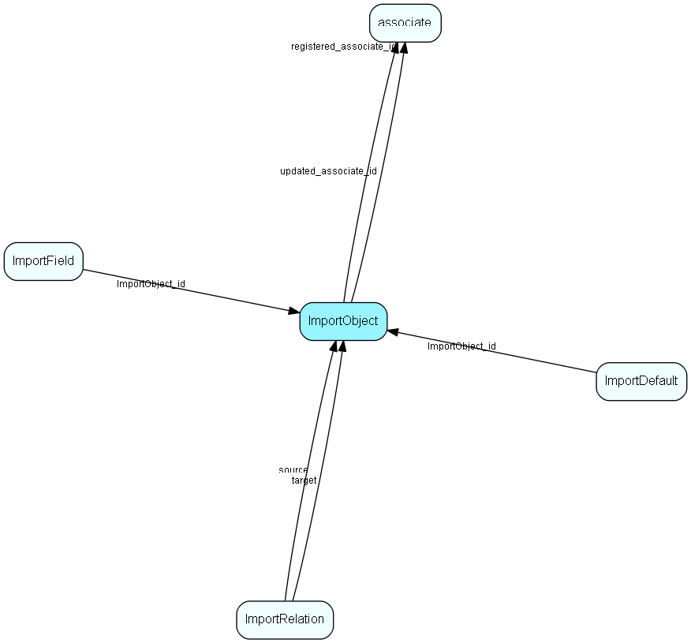

# ImportObject Table (186)

Import object types - see localetext for names.

## Fields

| Name | Description | Type | Null |
|------|-------------|------|:----:|
|ImportObject\_id|Primary key|PK| |
|tableId|Table id of target table for this object|TableNumber| |
|showInGui|If 1, this object is visible in the object property list in the GUI, otherwise insert anyway|UShort| |
|tag|Name of object, not visible to the user|String(11)|&#x25CF;|
|extensionOf|Id of parent object this object is an extension of, if any (may be included in keys of parent object)|Id|&#x25CF;|
|registered|Registered when|UtcDateTime| |
|registered\_associate\_id|Registered by whom|FK [associate](associate.md)| |
|updated|Last updated when|UtcDateTime| |
|updated\_associate\_id|Last updated by whom|FK [associate](associate.md)| |
|updatedCount|Number of updates made to this record|UShort| |
|isBuiltin|1 = This row populated and maintained by SuperOffice|UShort|&#x25CF;|

[!include[details](./includes/importobject.md)]

## Indexes

| Fields | Types | Description |
|--------|-------|-------------|
|ImportObject\_id |PK |Clustered, Unique |

## Relationships

| Table|  Description |
|------|-------------|
|[associate](associate.md)  |Employees, resources and other users - except for External persons |
|[ImportDefault](importdefault.md)  |Defaults for import fields/objects |
|[ImportField](importfield.md)  |Import object types - see localetext for names |
|[ImportRelation](importrelation.md)  |Relations between import objects |

## Replication Flags

* Replicate changes DOWN from central to satellites and travellers.
* Replicate changes UP from satellites and travellers back to central.
* Copy to satellite and travel prototypes.

## Security Flags

* No access control via user's Role.

