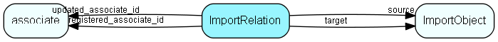

# ImportRelation Table (188)

Relations between import objects

## Fields

| Name | Description | Type | Null |
|------|-------------|------|:----:|
|ImportRelation\_id|Primary key|PK| |
|source|The dependent object (source of relation edge)|FK [ImportObject](importobject.md)| |
|target|The primary object (target of relation edge)|FK [ImportObject](importobject.md)| |
|edgeColour|1=Red, 2=Black|UShort| |
|foreignKey|The database field ID of the foreign key field in the dependent table. NOTE If it is 0, it means this relation should NOT lead to an edge in the graph.|FieldId| |
|forcePrimary|1=Forces creation of primary object as soon as dependent is created|UShort| |
|registered|Registered when|UtcDateTime| |
|registered\_associate\_id|Registered by whom|FK [associate](associate.md)| |
|updated|Last updated when|UtcDateTime| |
|updated\_associate\_id|Last updated by whom|FK [associate](associate.md)| |
|updatedCount|Number of updates made to this record|UShort| |
|isBuiltin|1 = This row populated and maintained by SuperOffice|UShort|&#x25CF;|

[!include[details](./includes/importrelation.md)]

## Indexes

| Fields | Types | Description |
|--------|-------|-------------|
|ImportRelation\_id |PK |Clustered, Unique |
|source |FK |Index |
|target |FK |Index |

## Relationships

| Table|  Description |
|------|-------------|
|[associate](associate.md)  |Employees, resources and other users - except for External persons |
|[ImportObject](importobject.md)  |Import object types - see localetext for names. |

## Replication Flags

* Replicate changes DOWN from central to satellites and travellers.
* Replicate changes UP from satellites and travellers back to central.
* Copy to satellite and travel prototypes.

## Security Flags

* No access control via user's Role.

