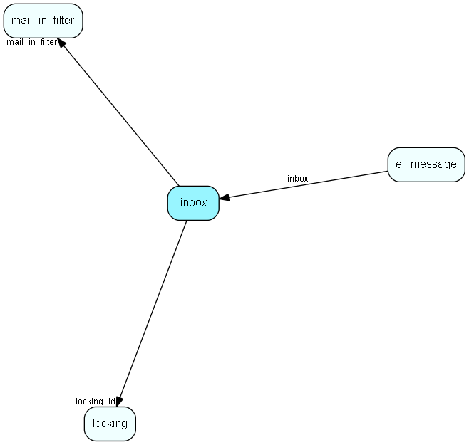

# inbox Table (352)

Info and status for safe email import

## Fields

| Name | Description | Type | Null |
|------|-------------|------|:----:|
|id|Primary key|PK| |
|mail\_in\_filter|A reference to the id of the mail box|FK [mail_in_filter](mail-in-filter.md)| |
|locking\_id|A reference to the id of lock|FK [locking](locking.md)| |
|uidl|The uidl of the message. Stored before the retrieval starts to prevent double import. For locking purposes|String(2047)|&#x25CF;|
|created|When the mail was created|DateTime|&#x25CF;|
|imported|When the mail was imported|DateTime| |
|status|Status enum|Int| |
|mail\_size|The size of the mail in bytes|Int| |
|next\_retry|When is the next time we should try again?|DateTime|&#x25CF;|
|plugin|Name of plugin that created this inbox entry|String(255)| |
|format|Format of the inbox entry|String(255)| |

[!include[details](./includes/inbox.md)]

## Indexes

| Fields | Types | Description |
|--------|-------|-------------|
|id |PK |Clustered, Unique |
|mail\_in\_filter |FK |Index |
|locking\_id |FK |Index |
|imported |DateTime |Index |
|status |Int |Index |

## Relationships

| Table|  Description |
|------|-------------|
|[ej\_message](ej-message.md)  |This table contains the messages listed under tickets. |
|[locking](locking.md)  |Generic locking and error messages |
|[mail\_in\_filter](mail-in-filter.md)  |This table contains entries for the mailboxes the eJournal system is fetching mail from (POP3 or IMAP). |

## Replication Flags

* None

## Security Flags

* No access control via user's Role.

