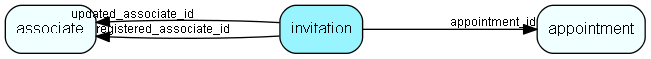

# invitation Table (491)

Invitations to events

## Fields

| Name | Description | Type | Null |
|------|-------------|------|:----:|
|invitation\_id|Primary key|PK| |
|event\_uid|The UID associated with this event, all integrators should refer to this UID when referring to the event|String(255)|&#x25CF;|
|event\_sequence|The current sequence number of the event info, so we know if we got a new or old event update|Int|&#x25CF;|
|event\_dtstamp|DTSTAMP so we know if we got a new or old event update when sequence is the same|DateTime|&#x25CF;|
|appointment\_id|The id of the mother appointment record|FK [appointment](appointment.md)|&#x25CF;|
|registered|Registered when|UtcDateTime| |
|registered\_associate\_id|Registered by whom|FK [associate](associate.md)| |
|updated|Last updated when|UtcDateTime| |
|updated\_associate\_id|Last updated by whom|FK [associate](associate.md)| |
|updatedCount|Number of updates made to this record|UShort| |
|organizer\_email|The email address of the organizer of the event.|String(255)|&#x25CF;|
|organizer\_fullname|The organizer&apos;s full name|String(255)|&#x25CF;|
|recurring\_end\_date|The end date for a recurring event|DateTime|&#x25CF;|
|recurring\_start\_date|The start date for a recurring event|DateTime|&#x25CF;|
|template\_language|The SO-language used for email invitations (see PhysicalDocument.GetTemplateLanguages(), CultureDataFormatter.MapCultureToSuperOfficeLanguage()|String(16)|&#x25CF;|

[!include[details](./includes/invitation.md)]

## Indexes

| Fields | Types | Description |
|--------|-------|-------------|
|invitation\_id |PK |Clustered, Unique |
|event\_uid |String(255) |Index |
|appointment\_id |FK |Index |

## Relationships

| Table|  Description |
|------|-------------|
|[appointment](appointment.md)  |Tasks, appointments, followups, phone calls; and documents (document_id != 0). An appointment always has a corresponding record in VisibleFor specifying who may see this.  |
|[associate](associate.md)  |Employees, resources and other users - except for External persons |

## Replication Flags

* None

## Security Flags

* No access control via user's Role.

