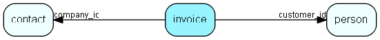

# invoice Table (265)

This table contains invoice entries, normally created when an invoice is sent to a customer, and we want to update the balance.

## Fields

| Name | Description | Type | Null |
|------|-------------|------|:----:|
|id|The primary key (auto-incremented)|PK| |
|time\_charged|The amount of time (minutes) charged. From version 2.8 this field is no longer in use|Int|&#x25CF;|
|price\_charged|The amount (money) charged.|Double|&#x25CF;|
|customer\_id|The reference to the customer entry this entry is connected to. NULL or -1 if not connected.|FK [person](person.md)| |
|company\_id|The reference to the company entry this entry is connected to. NULL or -1 if not connected.|FK [contact](contact.md)| |
|created\_at|When the invoice entry was created.|DateTime|&#x25CF;|
|description|A string describing the invoice entry.|String(255)|&#x25CF;|

[!include[details](./includes/invoice.md)]

## Indexes

| Fields | Types | Description |
|--------|-------|-------------|
|id |PK |Clustered, Unique |
|customer\_id |FK |Index |
|company\_id |FK |Index |

## Relationships

| Table|  Description |
|------|-------------|
|[contact](contact.md)  |Companies and Organizations.   This table features a special record containing information about the contact that owns the database.   |
|[person](person.md)  |Persons in a company or an organizations. All associates have a corresponding person record |

## Replication Flags

* None

## Security Flags

* No access control via user's Role.

