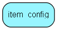

# item\_config Table (368)

This table is a generic table for storing item configuration. It is only used by the class ItemConfig.

## Fields

| Name | Description | Type | Null |
|------|-------------|------|:----:|
|id|Primary key|PK| |
|domain|The domain for which this item belongs (domains are defined in ItemConfig.h)|Int| |
|item\_id|The id of the element for which this item belongs|Int| |
|item\_name|The name for this config item|String(255)|&#x25CF;|
|item\_value|The value for this config item|Clob|&#x25CF;|

[!include[details](./includes/item-config.md)]

## Indexes

| Fields | Types | Description |
|--------|-------|-------------|
|id |PK |Clustered, Unique |
|domain |Int |Index |
|item\_id |Int |Index |

## Replication Flags

* None

## Security Flags

* No access control via user's Role.

