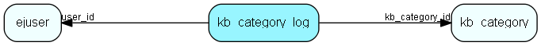

# kb\_category\_log Table (291)

Who and when, if somebody edits a knowledge base folder

## Fields

| Name | Description | Type | Null |
|------|-------------|------|:----:|
|id|The primary key (auto-incremented)|PK| |
|kb\_category\_id|The id of the kb_category that triggered this action.|FK [kb_category](kb-category.md)| |
|user\_id|The id of the user that created this comment.|FK [ejuser](ejuser.md)| |
|log\_when|When the action occured.|DateTime|&#x25CF;|

[!include[details](./includes/kb-category-log.md)]

## Indexes

| Fields | Types | Description |
|--------|-------|-------------|
|id |PK |Clustered, Unique |
|kb\_category\_id |FK |Index |
|user\_id |FK |Index |

## Relationships

| Table|  Description |
|------|-------------|
|[ejuser](ejuser.md)  |This table contains entries for the users of the system. |
|[kb\_category](kb-category.md)  |Knowledge base folder hierarchy |

## Replication Flags

* None

## Security Flags

* No access control via user's Role.

